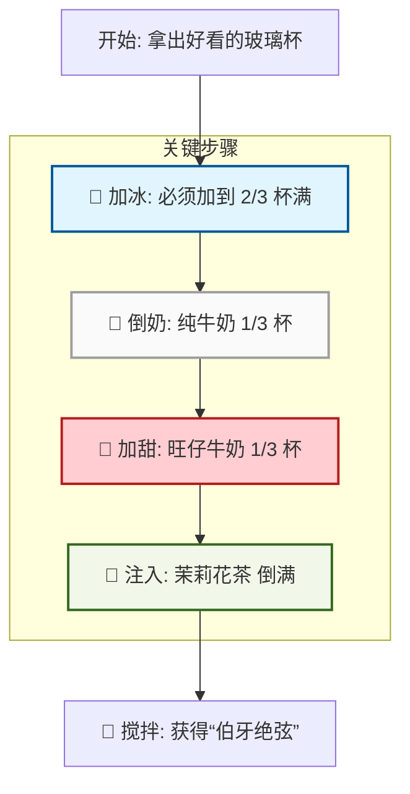

# 伯牙绝弦的制作步骤

```mermaid
graph TD
    Start[开始: 拿出好看的玻璃杯] --> Step1

    subgraph 关键步骤
    Step1[🧊 加冰: 必须加到 2/3 杯满] --> Step2
    Step2[🥛 倒奶: 纯牛奶 1/3 杯] --> Step3
    Step3[🍬 加甜: 旺仔牛奶 1/3 杯] --> Step4
    Step4[🍵 注入: 茉莉花茶 倒满]
    end

    Step4 --> Finish[🍹 搅拌: 获得“伯牙绝弦”]

    style Step1 fill:#e1f5fe,stroke:#01579b,stroke-width:2px
    style Step2 fill:#fafafa,stroke:#9e9e9e,stroke-width:2px
    style Step3 fill:#ffcdd2,stroke:#b71c1c,stroke-width:2px
    style Step4 fill:#f1f8e9,stroke:#33691e,stroke-width:2px
```
