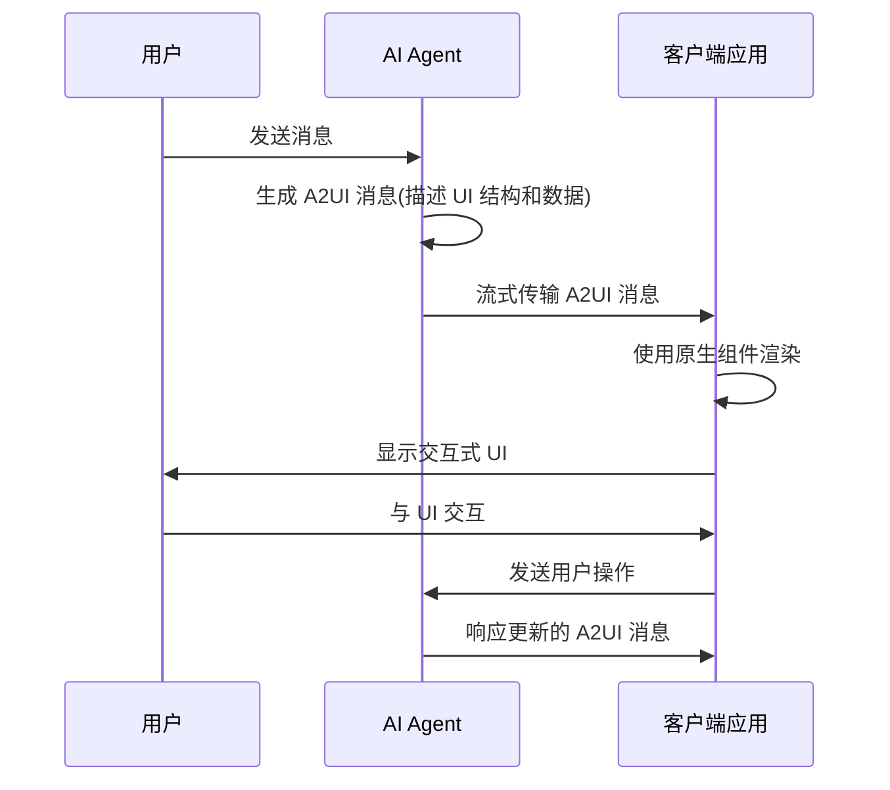

## A2UI 简介

A2UI 是一个**用于 Agent 驱动用户界面的协议**,由 Google 开发并开源(Apache 2.0 许可)。目前处于 **v0.8 公开预览版**状态,规范和实现已经可用,但仍在不断演进中。

### 核心问题

A2UI 解决的核心问题是:**如何让 AI Agent 安全地跨信任边界发送丰富的 UI?**

传统的方案存在两种极端:

1. **纯文本响应** - 用户体验差,无法进行复杂交互
2. **代码执行** - 存在安全风险,Agent 可能执行任意代码

A2UI 提供了一种折中方案:让 Agent 发送**声明式组件描述**,客户端使用自己的原生组件来渲染这些 UI。

## 核心特性

### 1. 安全优先(Secure by Design)

- **声明式数据格式** - 不是可执行代码
- **组件白名单** - Agent 只能使用你预先批准的组件目录中的组件
- **防止 UI 注入攻击** - 无法注入恶意组件

### 2. LLM 友好(LLM-Friendly)

- **扁平化 JSON 结构** - 易于 LLM 生成
- **流式设计** - LLM 可以增量构建 UI,无需一次性生成完美的 JSON
- **渐进式渲染** - 用户可以实时看到界面构建过程

### 3. 框架无关(Framework-Agnostic)

- **一次编写,到处运行** - 同一个 Agent 响应可以在不同平台上渲染
- **支持多平台** - Angular、Flutter、React、原生移动端等
- **自定义样式** - 使用你自己的样式化组件

### 4. 渐进式渲染(Progressive Rendering)

- **实时流式更新** - 边生成边渲染,无需等待完整响应
- **即时反馈** - 用户可以立即看到界面构建过程
- **更好的用户体验** - 减少等待时间

## 工作原理

A2UI 的工作流程如下:



1. **用户发送消息**给 AI Agent
2. **Agent 生成 A2UI 消息**描述 UI(结构 + 数据)
3. **消息流式传输**到客户端应用
4. **客户端使用原生组件**渲染(Angular、Flutter、React 等)
5. **用户与 UI 交互**,将操作发送回 Agent
6. **Agent 响应**更新的 A2UI 消息

## 架构组件

### 1. A2UI 规范

定义协议的完整技术规范和消息类型:

- 组件描述格式
- 数据绑定模型
- 消息类型和结构
- 邻接表模型

### 2. 渲染器(Renderers)

客户端实现,负责将 A2UI 消息渲染为原生组件:

- **Angular** - Angular 组件渲染
- **Flutter** - Flutter widget 渲染
- **React** - React 组件渲染
- **原生移动端** - iOS/Android 原生渲染

### 3. 传输层(Transports)

在 Agent 和客户端之间通信 A2UI 消息:

- **A2A** - Agent to Agent 协议
- 其他传输协议支持

## 实际应用示例

### 1. 园林设计师 Demo

在这个示例中:

- 用户上传一张照片
- Agent 使用 Gemini 理解照片内容
- Agent 生成定制的园林需求表单
- 完整的 UI 都是 Agent 动态生成的

### 2. 自定义组件: 交互式图表和地图

Agent 可以根据问题类型选择合适的组件:

- **数值总结问题** → Agent 选择图表组件
- **位置相关问题** → Agent 选择 Google Map 组件
- 这些都是客户端提供的自定义组件

### 3. A2UI Composer

CopilotKit 提供了公开的 [A2UI Widget Builder](https://go.copilotkit.ai/A2UI-widget-builder),可以:

- 可视化构建 A2UI 组件
- 实时预览渲染效果
- 测试组件交互

## 快速开始

### 安装和设置

```bash
# 克隆仓库
git clone https://github.com/google/A2UI.git
cd A2UI

# 安装依赖
npm install

# 运行示例
npm run demo
```

### 基本使用流程

1. **定义组件目录** - 创建客户端可用的组件列表
2. **配置渲染器** - 在客户端集成 A2UI 渲染器
3. **生成 A2UI 消息** - Agent 根据用户输入生成 UI 描述
4. **渲染 UI** - 客户端接收并渲染消息

## 核心概念

### Surface(表面)

定义 UI 的容器和布局结构。

### Component(组件)

UI 的基本构建块,包含:

- 组件类型
- 属性配置
- 数据绑定
- 事件处理

### Data Binding(数据绑定)

将 Agent 生成的数据绑定到组件属性。

### Adjacency List Model(邻接表模型)

使用邻接表表示组件树结构,便于流式传输和增量更新。

## 技术优势

### 相比传统方案

| 方案       | 安全性 | 交互性 | 实现复杂度 |
| ---------- | ------ | ------ | ---------- |
| 纯文本响应 | ✅ 高  | ❌ 差  | ✅ 低      |
| 代码执行   | ❌ 低  | ✅ 好  | ⚠️ 中      |
| **A2UI**   | ✅ 高  | ✅ 好  | ⚠️ 中      |

### 相比其他 UI 生成方案

- **更安全** - 声明式而非命令式
- **更灵活** - 支持自定义组件
- **更流畅** - 流式渲染,无需等待
- **更通用** - 跨平台,跨框架

## 适用场景

### 理想场景

1. **AI 聊天机器人** - 需要丰富交互的智能助手
2. **动态表单生成** - 根据上下文自动生成表单
3. **数据可视化** - Agent 驱动的图表和报表
4. **多平台应用** - 需要跨平台一致体验的应用

### 注意事项

- 目前处于预览阶段,API 可能会有变化
- 需要客户端集成渲染器
- 需要定义组件目录
- Agent 需要理解 A2UI 协议

## 学习资源

- [快速开始指南](https://a2ui.org/quickstart/) - 5 分钟上手
- [核心概念](https://a2ui.org/concepts/overview/) - 深入理解设计理念
- [开发者指南](https://a2ui.org/guides/client-setup/) - 集成到你的应用
- [协议规范](https://a2ui.org/specification/v0.8-a2ui/) - 完整技术参考
- [GitHub 仓库](https://github.com/google/A2UI) - 源码和问题追踪

## 未来展望

A2UI 为 AI Agent 和用户界面的交互提供了一个新的范式:

1. **更安全的 AI 交互** - 不需要执行任意代码
2. **更丰富的用户体验** - 超越纯文本响应
3. **更灵活的开发方式** - 一次编写,多处运行
4. **更强的可扩展性** - 支持自定义组件和传输协议

随着 AI Agent 的发展,A2UI 这样的协议将变得越来越重要,它让 AI 能够以安全、可控的方式与用户进行丰富的交互。

## 总结

A2UI 是一个创新的解决方案,它在安全性和交互性之间找到了平衡点。通过声明式的组件描述和流式渲染,A2UI 让 AI Agent 能够生成丰富、交互式的用户界面,同时保持安全性和跨平台兼容性。

虽然目前还处于早期阶段,但 A2UI 展示了 AI Agent 驱动界面的巨大潜力,值得我们持续关注和探索。
