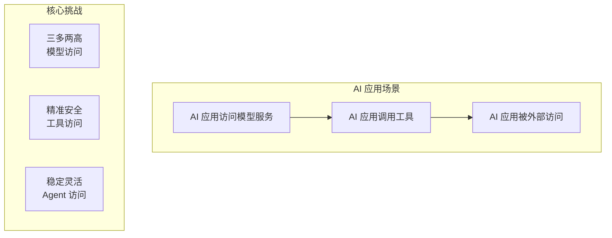
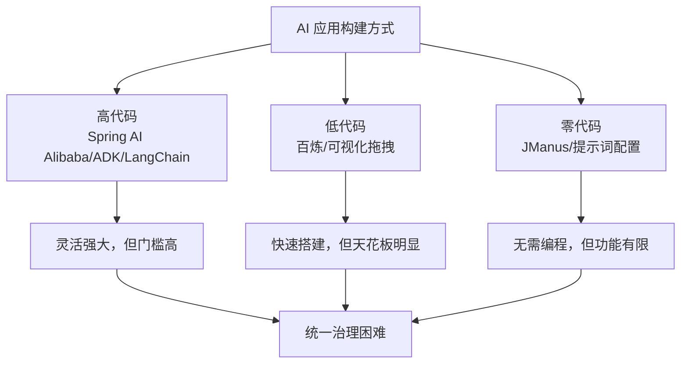
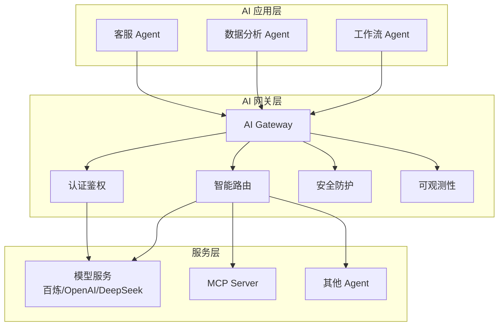

> 本文内容主要参考[阿里云 AI 网关官方文档](https://help.aliyun.com/zh/api-gateway/ai-gateway/product-overview/what-is-an-ai-gateway)。

## 引言：AI 原生架构时代的基础设施变革

在企业数字化转型的浪潮中，人工智能正从"可选项"演变为"必选项"。随着大语言模型（LLM）技术的成熟，AI 应用场景呈指数级增长，企业应用架构也从微服务、云原生架构向 **AI 原生架构** 演进。

这一演进带来了全新的技术挑战：

- **模型多样**：如何统一管理来自不同供应商的模型 API？
- **协议碎片**：MCP、A2A、WebSocket……各类协议如何整合？
- **安全合规**：敏感数据如何在使用 AI 的过程中得到保护？
- **成本失控**：Token 消耗如何精细化计量和优化？

**AI 网关**（AI Gateway）应运而生，成为连接 AI 应用与模型服务、工具及其他 Agent 之间的核心组件。本文将深入解析 AI 网关的设计理念、核心能力和典型实践。

> **关联阅读**：阿里云 [AgentRun 平台](https://help.aliyun.com/zh/functioncompute/fc/what-is-agentrun) 将 AI 网关作为其[核心组件之一](data/blog/zh/cs/ai-series/agent/agent-run-poc.mdx)，提供开箱即用的模型治理与工具治理能力。

## AI 应用三大场景与核心挑战

在深入 AI 网关之前，我们需要理解企业 AI 应用面临的三大核心场景及其挑战。

### 场景全景图

根据 AI 应用的流量特征，可将其划分为以下三类场景：

### 场景一：访问模型服务 — 三多两高

AI 应用的核心特性在于利用模型能力进行推理与规划。在模型访问场景中，企业普遍面临 **"三多两高"** 的挑战：

#### 三多

| 维度       | 挑战                                                             | 影响                                 |
| ---------- | ---------------------------------------------------------------- | ------------------------------------ |
| **多模型** | 不同供应商的 API 接口规范、认证机制和调用方式存在差异            | 难以实现跨供应商的统一集成与灵活切换 |
| **多模态** | 文生文、文生图、语音识别等模型在传输协议、通信模式上缺乏统一标准 | 接口形态多样化，系统集成复杂度高     |
| **多场景** | 不同业务场景对延迟、稳定性、限流策略的需求各异                   | 难以实现精细化的服务质量保障         |

#### 两高

| 维度             | 挑战                                   | 影响                                   |
| ---------------- | -------------------------------------- | -------------------------------------- |
| **安全要求高**   | 敏感数据传输与处理需满足数据合规性要求 | 需防止数据泄露、实现审计追踪和访问控制 |
| **稳定性要求高** | 模型服务响应延迟波动大，接口限流阈值低 | 服务可用性不稳定，影响用户体验         |

### 场景二：访问工具 — 精准安全

工具作为 AI 应用与外部系统交互的桥梁，通过 MCP 等标准化协议实现调用。该场景的核心挑战在于 **高效性与安全性的平衡**：

- **Token 消耗问题**：工具数量增长导致输入给大模型的工具列表膨胀
- **模型误选风险**：候选工具过多可能降低执行准确率
- **安全风险**：不当的工具调用可能扩大系统攻击面（如 MCP 恶意投毒）

### 场景三：访问 AI 应用 — 稳定灵活

AI 应用可通过多种方式构建，不同开发模式导致接入方式缺乏统一标准：

此外，AI 应用高度依赖底层大模型，输出稳定性存在不确定性，单点故障可能引发连锁反应。

## AI 网关的核心定位

AI 网关是 **AI 应用与模型服务、工具及其他 Agent 之间的桥梁**，通过提供以下能力解决上述挑战：

- **协议转换**：统一不同模型供应商的 API 规范
- **安全防护**：多层次的安全机制保障数据与应用安全
- **流量治理**：限流、熔断、负载均衡等能力保障稳定性
- **统一观测**：全链路可观测性支持问题排查与优化

## 三大场景的典型实践

### 实践一：模型访问的统一治理

企业计划构建 AI 应用以提升经营效率，针对不同需求集成多种模型服务：

- **主模型**：部署于 PAI 的微调模型
- **兜底服务**：阿里云百炼
- **特定场景**：部署于函数计算的开源模型（如图像生成）

通过 AI 网关实现统一管理：

- **多模型路由**：基于模型名称、请求特征或比例的灵活路由策略
- **协议统一**：将不同供应商的协议转换为 OpenAI 兼容接口
- **消费者维度的治理**：独立鉴权、监控、限流及计量
- **多层次安全防护**：网络层（WAF/IP 黑名单）、数据层（API Key 管理/脱敏）、内容层（AI 安全护栏）

### 实践二：工具访问的精准安全

企业选定 MCP 作为工具访问的标准协议，利用 AI 网关的 HTTP to MCP 转换能力：

- **存量 HTTP 服务转换**：将现有 API 自动转换为 MCP Server
- **智能工具路由**：根据请求内容自动筛选相关工具，减少 Token 消耗
- **细粒度权限控制**：支持 MCP Server 级别和单个工具级别的访问权限配置

### 实践三：Agent 访问的稳定灵活

企业将 AI 应用统一接入 AI 网关，基于 A2A 协议实现服务发现与调用：

- **多平台统一暴露**：直连 ACK、FC、SAE 等不同运行平台
- **健康检查机制**：主动与被动健康检查，自动隔离异常节点
- **灰度发布能力**：降低变更风险，支持多维度限流

## AI 网关核心能力详解

### 统一代理能力

AI 网关支持对多种服务类型的统一接入与管理：

| 服务类型       | 说明                                                                                     |
| -------------- | ---------------------------------------------------------------------------------------- |
| **AI 服务**    | 百炼、OpenAI、Anthropic、Bedrock、Azure 等厂商模型，支持自建模型（Ollama、vLLM、SGLang） |
| **Agent 服务** | 百炼、Dify 及自定义 Agent 工作负载                                                       |
| **容器服务**   | 阿里云 ACK/ACS 集群上的服务                                                              |
| **Nacos 服务** | MSE Nacos 注册中心的普通微服务及 MCP Server                                              |
| **函数计算**   | FC 服务，绕过 HTTP Trigger 直接集成                                                      |
| **固定地址**   | IP:Port 列表形式配置                                                                     |

### 健康检查机制

| 类型             | 说明                                           |
| ---------------- | ---------------------------------------------- |
| **主动健康检查** | 网关周期性向服务节点发送探测请求，判断可用状态 |
| **被动健康检查** | 基于实际请求处理表现评估节点健康状态           |

### 消费者维度的精细化管理

#### 认证鉴权

支持三种鉴权方式：

- **API-KEY**：简单易用的凭证方式
- **JWT**：基于令牌的身份验证
- **HMAC**：基于消息摘要的身份验证

敏感凭证可托管至 KMS 进行安全管理。

#### 可观测性指标

| 指标类别     | 具体指标                                  |
| ------------ | ----------------------------------------- |
| **流量指标** | QPS（请求/响应）、请求成功率              |
| **性能指标** | 平均 RT、流式首包 RT、缓存命中率          |
| **资源消耗** | Token 消耗数（输入/输出/总计）            |
| **治理效果** | 限流统计、风险统计、按模型/消费者维度分析 |

### AI 安全防护

AI 网关集成 AI 安全防护能力，支持多维度安全检测：

| 防护维度          | 说明           |
| ----------------- | -------------- |
| contentModeration | 内容合规检测   |
| promptAttack      | 提示词攻击检测 |
| sensitiveData     | 敏感内容检测   |
| maliciousFile     | 恶意文件检测   |
| waterMark         | 数字水印标识   |

针对不同维度可配置独立的拦截策略（高/中/低/观察模式）。

### 扩展与定制

AI 网关提供丰富的内置策略与插件，同时支持自定义插件开发：

- **内置策略**：安全防护、限流、缓存、联网搜索等
- **自定义插件**：支持用户开发特定业务场景的扩展
- **热插拔与热更新**：配置变更不影响服务流量

## 与 Kong 网关的对比

提到网关，**Kong** 是开源社区中最知名的 API 网关方案。两者对比如下：

| 维度            | Kong           | AI 网关             |
| --------------- | -------------- | ------------------- |
| **设计目标**    | 通用 API 网关  | 专为 AI 场景设计    |
| **模型支持**    | 需通过插件实现 | 原生支持多厂商模型  |
| **Token 计量**  | 需额外开发     | 内置 Token 消耗统计 |
| **MCP 协议**    | 不支持         | 原生支持            |
| **AI 安全防护** | 需集成第三方   | 内置 AI 安全护栏    |
| **适用场景**    | 通用微服务网关 | AI 应用流量治理     |

对于 AI 应用场景，专用 AI 网关在功能完整性和使用便捷性上具有明显优势。

## 总结

AI 网关作为 AI 原生架构的核心组件，通过统一代理、安全防护、流量治理和可观测性四大能力，解决企业在模型访问、工具访问和 Agent 访问三大场景中的核心挑战。

对于刚开始构建 AI 应用的企业，建议：

1. **从小规模试点开始**：选择一个典型的 AI 应用场景，验证 AI 网关的价值
2. **优先解决痛点**：根据实际业务需求，选择最迫切需要解决的能力（如统一模型接入、安全防护或成本计量）
3. **渐进式演进**：从单一能力开始，逐步扩展到完整的 AI 网关能力集

AI 网关正在成为企业 AI 基础设施的标准配置，值得每个正在进行 AI 转型的团队深入了解和实践。

---

**参考资源**：

- [阿里云 AI 网关官方文档](https://help.aliyun.com/zh/api-gateway/ai-gateway/product-overview/what-is-an-ai-gateway)
- [阿里云 AgentRun 平台](https://help.aliyun.com/zh/functioncompute/fc/what-is-agentrun)
- [MCP 协议规范](https://modelcontextprotocol.io/)
- [Kong AI Gateway 插件](https://docs.konghq.com/hub/kong-inc/ai-gateway/)
