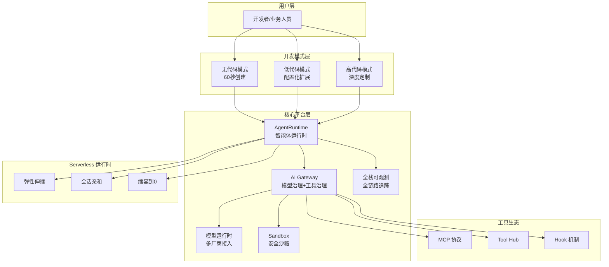
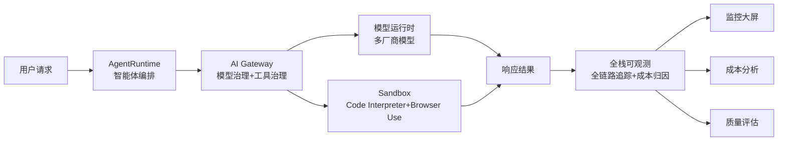
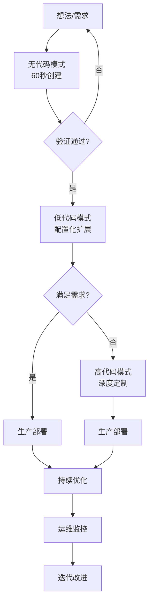
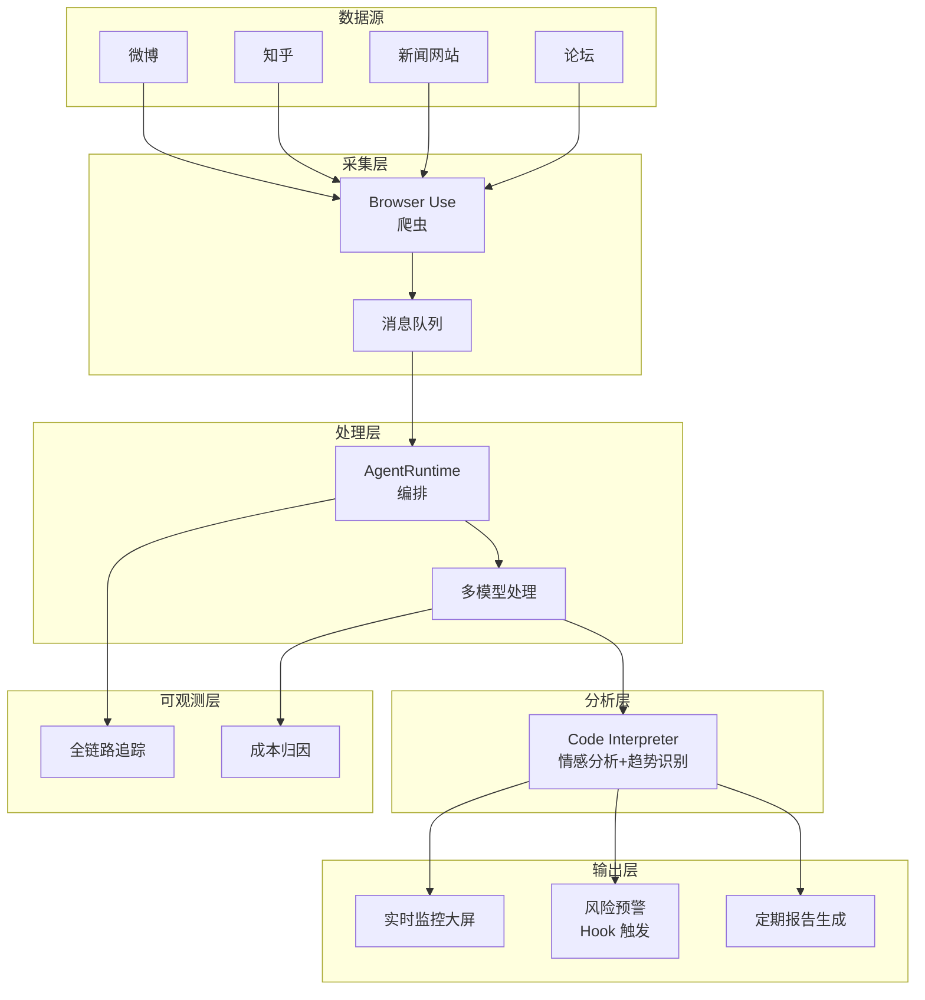

## 场景切入：舆情分析的痛点

最近我一直在思考一个问题：企业如何快速构建一个舆情监控系统？

想象这样一个场景：你需要实时监控社交媒体、新闻平台、论坛等渠道的品牌提及，实现数据采集、情感分析、趋势识别、风险预警、报告生成全流程自动化。

听起来很美，但实际做起来呢？

**技术挑战接踵而至**：

- 多源数据采集：需要爬虫能力，不同平台接口各异
- 实时处理能力：突发流量时如何应对？
- 代码安全性：第三方脚本如何安全执行？
- 成本控制：按需扩缩容如何实现？
- 模型切换：不同厂商模型效果不同，如何统一管理？

传统开发方式需要搭建多个系统：爬虫服务、消息队列、容器编排、模型服务、监控告警……开发周期长、维护成本高。

如果有这样一个平台，可以一站式解决这些问题呢？

## 传统方案的困境

在探索解决方案之前，我们先看看传统方案的问题。

### 低代码平台的局限

低代码平台确实能快速上手，60秒就能创建一个 Agent。但问题也很明显：

**天花板效应**：遇到复杂需求立即碰壁

- 无法实现个性化策略（如不同用户不同模型选择）
- 无法实现复杂逻辑控制（如动态凭证注入）
- 成本和性能优化困难

**技术债务**：要么放弃，要么推倒重来
业务人员用低代码快速验证了想法，但到了生产环境需要深度定制时，发现必须用高代码重写。前面的投入全部打水漂。

### 高代码开发的问题

高代码开发确实灵活强大，但：

**验证周期长**：从想法到可用系统，需要 1-3 个月
**初期投入大**：需要搭建整套基础设施
**门槛高**：业务人员无法参与

### 传统架构的困境

即使你有技术团队，传统架构也面临：

- 需要分别搭建多个子系统（爬虫、队列、编排、监控）
- 运维复杂，需要专业团队
- 成本高，资源利用率低

## AgentRun：一站式 Agentic AI 基础设施

**AgentRun** 是阿里云函数计算推出的一站式 Agentic AI 基础设施平台，专门为智能体应用生命周期设计。

### 核心定位

以**高代码为核心，开放生态、灵活组装**的理念，为企业级 Agentic 应用提供开发、部署与运维全生命周期管理。

### 四大核心能力

1. **云原生运行底座**：基于函数计算 FC 的 Serverless 架构
2. **沙箱平台**：安全隔离的代码执行和浏览器自动化环境
3. **模型治理与工具生态**：统一接入多厂商模型，支持 MCP 协议
4. **安全与可观测能力**：全链路追踪、Token 级别成本归因

### 核心价值

让团队在开发 AI Agent 时，不用再自己搭建一整套执行环境、模型网关、工具调用、日志监控、权限体系，而是直接站在一个专门为 Agent 场景优化过的 Serverless 平台之上，专注于业务逻辑和智能体行为本身。

### 整体架构



## 核心技术架构

### 四大核心引擎

#### 1. 智能体运行时与云沙箱

**核心技术特性**：

- **安全隔离**：采用自研"袋鼠安全容器"
  - 具备虚拟机级的隔离强度
  - 拥有容器级的百毫秒启动速度
  - 实现多维度多租户隔离（存储、网络、算力）

- **极致弹性**：
  - 实例管理做成数据平面，支持集群规模无限水平扩展
  - 单集群支持百万规模运行时实例和沙箱实例
  - 单服务支持百万 QPS
  - 百毫秒冷启动 + 1 毫秒忙闲时智能极速热切

- **精益成本**：
  - 首创按实例"忙/闲"状态独立计费模式
  - Agent 等待模型或工具响应时（闲置状态）算力免费
  - 仅收取极低内存费用
  - 平均降低 60% TCO 成本

- **内置工具**：
  - Code Interpreter（代码解释器）
  - Browser Tool（浏览器沙箱）
  - 多语言执行引擎与浏览器自动化引擎（基于 Playwright）

#### 2. 模型运行时

**技术亮点**：

- **请求感知调度引擎**：实时追踪负载，优先使用热实例
- **快照恢复技术**：将闲置实例唤醒时间压缩至毫秒级（百倍启动加速）
- **算力解耦**：提供更细粒度的 CPU/GPU 组合
- **成本优化**：帮助客户平均降低 40% 的 GPU 成本，将 AI 应用 RT 抖动减少 80%

#### 3. AI 网关

> **扩展阅读**：AI 网关是 AI 应用基础设施的核心枢纽。详见《[AI 网关：企业 AI 基础设施的核心枢纽](data/blog/zh/cs/ai-series/infra/ai-gateway.mdx)》。

**治理能力**：

- **模型治理**：
  - 统一代理屏蔽 API 差异
  - 模型熔断、多模型 Fallback、负载均衡
  - 模型服务高可用保障（稳定性达 99.9% 以上）

- **工具治理**：
  - MCP 标准化封装（Model Context Protocol）
  - Hook 机制与智能路由
  - Rest to MCP 一键转换

- **性能加速**：
  - 语义缓存、Cache、RAG 加速 AI 请求

#### 4. 全栈可观测性

**监控体系**：

- **基于 Prometheus 的 AI 全栈统一监控**：
  - 模型性能追踪
  - Token 成本分析
  - GPU 异动分析

- **基于 OpenTelemetry Trace 的端到端链路追踪**：
  - Agent 决策路径可视化
  - 每一步耗时与状态追踪
  - 意图理解、模型推理、工具调用全链路监控

### 技术架构分层图



## 三种开发模式：从验证到生产

AgentRun 提供三种开发模式，并且支持**一键切换**，这是其最大的创新。

### 无代码模式：60 秒快速创建

**操作步骤**：

1. 访问控制台，点击"创建 Agent"
2. 选择"快速创建"模式
3. 配置核心参数：
   - 模型选择：Qwen-Max（平台可根据任务类型智能推荐）
   - Prompt 描述：用自然语言描述需求（如"查询函数列表的客服 Agent"）
   - 工具选择：从工具市场选择"函数列表查询"、"函数详情查询"、"日志查询"
   - 优化建议：使用 Prompt AI 优化功能自动优化提示词
4. 点击创建，60 秒后上线

**适用场景**：

- 快速验证想法
- 原型开发
- 业务人员参与

### 低代码模式：配置化扩展

在无代码的基础上，通过配置化方式扩展能力：

- 自定义参数校验规则
- 配置多模型切换策略
- 配置工具调用顺序
- 配置数据持久化策略

**适用场景**：

- 中等复杂度场景
- 需要一定的定制能力

### 高代码模式：深度定制

支持 Python、Node.js、Java 等任意语言和任意框架（LangChain、AgentScope、CrewAI、Google ADK 等）。

**一键转换流程**：

```
1. 在 Agent 管理页面点击"转换为高代码"
2. 平台自动生成高质量 Python 代码
3. 代码结构清晰，包含完整注释
4. 可选择在线 IDE 编辑或下载到本地
```

**适用场景**：

- 生产环境深度定制
- 复杂逻辑控制
- 成本优化
- 系统集成

### 开发模式演进流程



### 核心优势对比

| 维度       | 低代码平台       | 高代码开发       | AgentRun             |
| ---------- | ---------------- | ---------------- | -------------------- |
| 开发效率   | ⭐⭐⭐⭐         | ⭐⭐             | ⭐⭐⭐⭐             |
| 灵活性     | ⭐               | ⭐⭐⭐⭐⭐       | ⭐⭐⭐⭐⭐           |
| 技术门槛   | ⭐⭐⭐⭐         | ⭐⭐             | ⭐⭐⭐（可灵活调整） |
| 验证周期   | ⭐⭐⭐⭐⭐       | ⭐               | ⭐⭐⭐⭐⭐           |
| 生产适用性 | ⭐               | ⭐⭐⭐⭐⭐       | ⭐⭐⭐⭐⭐           |
| 维护成本   | ⭐⭐             | ⭐⭐             | ⭐⭐⭐               |
| 技术债务   | ⭐⭐⭐⭐⭐（高） | ⭐⭐⭐⭐（中等） | ⭐（低）             |
| 适用场景   | 简单场景         | 复杂场景         | 全场景               |

## Serverless 运行时：弹性与亲和的平衡

AgentRun 基于阿里云函数计算 FC 构建，针对 Agent 场景做了深度优化。

### 弹性伸缩

根据流量自动扩缩容，应对突发流量：

- 稀疏调用场景：自动缩容到 0，节省成本
- 突发流量场景：快速扩容，保证用户体验
- 无需运维：无需维护服务器、容器或 K8s 集群

### 会话亲和

**问题**：传统 Serverless 无状态，无法支持多轮对话

**解决方案**：引入会话亲和机制，突破无状态限制

- 同一会话的所有请求路由到同一个实例
- 保持上下文状态
- 多轮对话流畅性

**性能提升**：通过毫秒级启动和上下文保持，性能超越传统方案 100 倍

### 缩容到 0

- 无请求时不计费，大幅降低成本
- 浅休眠计费：百毫秒级唤醒
- 深休眠计费：秒级唤醒

### 多语言支持

- Python 3.10/3.12
- Node.js 18/20
- Java 8/11/17
- Go 1.21+

### 性能指标

- 冷启动：百毫秒级别
- 并发能力：单集群百万实例、单服务百万 QPS
- 响应时间：RT 抖动减少 80%

## 模型治理：多厂商统一接入

AgentRun 提供统一的模型治理能力，解决企业使用多种模型的痛点。

### 多厂商支持

- 阿里云通义千问
- OpenAI
- Anthropic
- 智谱
- DeepSeek

### 模型治理能力

```yaml
models:
  - name: qwen-max
    provider: alibaba
    priority: 1 # 主模型
    fallback: gpt-4

  - name: gpt-4
    provider: openai
    priority: 2 # 备用模型
    fallback: claude-3

  - name: claude-3
    provider: anthropic
    priority: 3 # 兜底模型

routing_strategy: load_balanced # 负载均衡
```

### 智能模型选择策略

```python
def intelligent_model_routing(user, query):
    """根据用户等级和查询复杂度选择模型"""
    factors = {
        'user_level': user.level,  # VIP, regular
        'query_complexity': analyze_complexity(query),  # high, medium, low
        'time_sensitive': is_time_sensitive(query),  # bool
        'historical_success_rate': get_success_rate(user)
    }

    # 简单查询 + 普通用户 = 小模型
    if factors['query_complexity'] == 'low' and factors['user_level'] == 'regular':
        return 'Qwen-Turbo'

    # 复杂查询或 VIP 用户 = 大模型
    if factors['query_complexity'] == 'high' or factors['user_level'] == 'VIP':
        return 'Qwen-Max'

    # 其他情况 = 中等模型
    return 'Qwen-Plus'
```

### 模型治理收益

- 提高模型稳定性至 99.9% 以上
- GPU 成本平均降低 40%
- RT 抖动减少 80%
- Token 消耗优化

## 安全沙箱：代码执行与浏览器自动化

AgentRun 提供企业级安全沙箱能力，支持代码执行和浏览器自动化。

### Code Interpreter

安全执行 Python/Node.js/Java 代码：

- 数据分析
- 数据可视化
- 算法验证

**使用场景**：

- 舆情分析中进行情感分析和趋势可视化
- 数据探索和实验
- 临时数据处理

### Browser Use

自动化浏览器操作，基于 Playwright 连接 Chrome 实例：

- 网页爬虫
- 自动化测试
- 表单填写

**核心技术特性**：

- 真实浏览器环境：提高复杂网页采集成功率
- 安全隔离：独立的浏览器沙箱，避免爬虫任务影响服务器
- 可视化调试：实时 VNC 预览功能，观察浏览器操作过程
- 弹性扩展：支持 3.5 万+ 沙箱/分钟并发处理

### 企业级安全隔离

- 基于安全容器的多级隔离（请求级、实例级、会话级）
- 存储隔离，支持挂载 OSS/NAS
- 平台统一维护与升级
- 数据不出域：支持 VPC/IDC 网络打通

### 性能优化

- 浅休眠：毫秒级唤醒，几乎无冷启动感知
- 深休眠：秒级唤醒，兼顾成本与性能
- 百万并发：支持百万级沙箱模板并发运行

## 工具生态：MCP 协议与 Hook 机制

AgentRun 提供开放的工具生态，支持 MCP 协议和 Hook 机制。

### MCP 协议

**MCP (Model Context Protocol)** 是开放的工具协议，支持第三方工具接入：

- Agent、Sandbox、API 工具一键 MCP 化
- Function Call 协议兼容
- Tool Hub 生态，内置丰富的工具库

### Hook 机制

在 Agent 执行前后插入自定义逻辑，实现灵活的扩展。

#### 前置 Hook

```javascript
async function preHook(context) {
  // 1. 参数校验
  if (!context.input.keyword) {
    throw new Error('Missing keyword parameter')
  }

  // 2. 权限检查
  const hasPermission = await checkPermission(context.userId, 'sentiment_analysis')
  if (!hasPermission) {
    throw new Error('Permission denied')
  }

  // 3. 数据预处理
  context.input.keyword = context.input.keyword.trim()

  // 4. 动态凭证注入
  access_key = get_access_key_by_user(user_id)
  secret_key = get_secret_key_by_user(user_id)
  context.credentials = {
    access_key: access_key,
    secret_key: secret_key,
  }

  return context
}
```

#### 后置 Hook

```javascript
async function postHook(context) {
  const result = context.result

  // 1. 如果检测到负面舆情，触发告警
  if (result.sentiment < -0.7 && result.risk_level === 'high') {
    await sendAlert({
      type: 'sentiment_risk',
      level: 'high',
      keyword: context.input.keyword,
      sentiment: result.sentiment,
      timestamp: new Date().toISOString(),
    })
  }

  // 2. 敏感信息过滤
  result = filter_sensitive_info(result)

  // 3. 审计日志
  audit_log(result)

  // 4. 数据落库
  await saveToDatabase(result)

  return context
}
```

### Tool Hub

内置丰富的工具库：

- 数据库查询
- API 调用
- 文件操作
- 数据处理
- 通知服务

自定义工具可发布到 Tool Hub，实现能力复用。

## 实战案例：舆情分析系统

让我们用 AgentRun 构建一个完整的舆情分析系统。

### 需求分析

**数据源**：

- 微博
- 知乎
- 新闻网站
- 论坛

**功能**：

- 实时采集
- 情感分析
- 趋势识别
- 风险预警
- 报告生成

### 实现步骤

#### 阶段 1：无代码快速验证（第 1 天）

**目标**：快速验证想法

**操作**：

1. 无代码模式创建 Agent
2. 配置数据源工具（微博、知乎爬虫）
3. 配置情感分析工具
4. 测试基本流程

**效果**：当天下午即上线服务内部测试用户

#### 阶段 2：遇到问题（第 3 天）

**用户反馈的问题**：

- ❌ 调用工具时报"权限不足"错误
- ❌ 多用户使用时数据混乱
- ❌ 成本增长快但无法追踪

**问题根源**：无代码界面无法实现复杂的逻辑控制

#### 阶段 3：一键转换为高代码（第 5 天）

**转换过程**：

1. 在 Agent 管理页面点击"转换为高代码"
2. 平台自动生成高质量 Python 代码
3. 添加动态凭证注入（前置 Hook）
4. 添加会话亲和机制配置
5. 添加智能模型选择策略

**高代码解决方案**：

```python
# 舆情分析 Agent 配置
export const config = {
    name: 'sentiment-analysis-agent',
    version: '1.0.0',

    # 模型配置
    models: {
        primary: 'qwen-max',
        fallback: ['gpt-4', 'claude-3'],
        routing: 'intelligent'  # 智能路由
    },

    # 工具配置
    tools: [
        {
            name: 'browser',
            type: 'browser-use',
            enabled: true
        },
        {
            name: 'code-interpreter',
            type: 'code-interpreter',
            enabled: true,
            language: 'python'
        }
    ],

    # Hook 配置
    hooks: {
        pre: './hooks/pre-hook.js',
        post: './hooks/post-hook.js'
    },

    # 运行时配置
    runtime: {
        type: 'serverless',
        concurrency: 1000,
        timeout: 300,
        memory: 1024,
        session_affinity: {
            enabled: True,
            storage_type: 'isolated',
            affinity_key: 'user_id'
        }
    }
};
```

**效果**：

- ✅ 权限问题解决（动态凭证注入）
- ✅ 数据隔离彻底（会话亲和机制）
- ✅ 成本降低 40%（智能模型选择）

#### 阶段 4：持续优化（两周后）

**新增功能**：

```python
# 1. 智能缓存机制
from functools import lru_cache

@lru_cache(maxsize=1000)
def query_with_cache(query_key):
    result = execute_query(query_key)
    return result
# 响应时间：2秒 → 0.1秒

# 2. 上下文压缩（减少 Token 消耗）
def compress_context(conversation_history):
    # 提取关键信息，去除冗余
    return summarize_and_compress(conversation_history)

# 3. 工单系统集成
def create_ticket_if_needed(issue):
    if issue.severity == 'high':
        ticket = external_ticket_system.create(
            title=issue.title,
            priority=issue.priority
        )
        return ticket
```

### 舆情分析系统数据流图



### 效果总结

- 开发周期：3 个月 → 2 周（缩短 83%）
- 人力成本：24 人月 → 4 人月（降低 83%）
- 基础设施成本：降低 60%
- GPU 成本：降低 40%
- 运维成本：降低 70%
- TCO（总拥有成本）：降低 60%

## 性能指标与成本优化

### 性能指标

| 指标        | 数值           | 对比           |
| ----------- | -------------- | -------------- |
| 冷启动      | 百毫秒级别     | 传统方案：数秒 |
| 并发能力    | 单集群百万实例 | 传统方案：有限 |
| 单服务 QPS  | 百万           | 传统方案：数千 |
| RT 抖动减少 | 80%            | 传统方案：基准 |
| 模型稳定性  | 99.9% 以上     | 传统方案：95%  |

### 成本优化

| 项目             | 自建方案       | AgentRun         | 节省比例 |
| ---------------- | -------------- | ---------------- | -------- |
| 开发时间         | 3 个月         | 2 周             | 83%      |
| 人力成本（人月） | 24             | 4                | 83%      |
| 基础设施成本     | 高（需要多个） | 低（一站式）     | 60%      |
| GPU 成本         | 基准           | 降低 40%         | 40%      |
| 运维成本         | 高             | 低（Serverless） | 70%      |
| TCO              | 基准           | 降低 60%         | 60%      |

### 成本优化策略

1. **智能模型路由**：简单任务用小模型，复杂任务用大模型
2. **缓存机制**：相同查询直接返回缓存
3. **上下文压缩**：减少 Token 消耗
4. **缩容到 0**：无请求时不计费
5. **按实例忙/闲状态独立计费**：闲置状态算力免费

## 最佳实践

### 开发策略

**先用无代码快速验证，确认方案可行后再切换到高代码**

```
开始阶段（0-1）：
├─ 业务需求不明确？→ 无代码快速验证
├─ 原型需求？→ 无代码 60 秒创建
└─ 探索性质？→ 无代码快速迭代

演进阶段（1-10）：
├─ 需要个性化策略？→ 转换高代码
├─ 需要成本优化？→ 转换高代码
├─ 需要复杂逻辑？→ 转换高代码
└─ 需要系统集成？→ 转换高代码

生产阶段（10-100）：
├─ 利用基础设施能力（模型代理、Hook）
├─ 实现监控和日志
└─ 持续优化性能和成本
```

### 模型治理最佳实践

1. **配置主备模型，确保高可用**
2. **使用负载均衡分摊请求**
3. **根据场景选择合适模型**
   - 简单任务用小模型（如 Qwen-Turbo）
   - 复杂任务用大模型（如 Qwen-Max）
4. **配置超时和重试机制**
5. **开启成本监控，及时发现异常**

### 沙箱使用最佳实践

| 沙箱类型         | 应用场景                       |
| ---------------- | ------------------------------ |
| Code Interpreter | 数据分析、数据可视化、算法验证 |
| Browser Sandbox  | 网页爬虫、自动化测试、表单填写 |

**注意事项**：

- 使用 Code Interpreter 进行数据分析和可视化
- 使用 Browser Sandbox 实现浏览器自动化
- 配置合理的超时时间
- 定期清理临时文件

### Hook 机制最佳实践

**前置 Hook**：

- 参数校验
- 权限检查
- 数据预处理
- 动态凭证注入

**后置 Hook**：

- 结果处理
- 数据落库
- 告警触发
- 审计日志

### 性能优化清单

- ✅ 智能缓存：相同查询直接返回缓存
- ✅ 上下文压缩：减少 Token 消耗
- ✅ 模型智能路由：简单用小模型，复杂用大模型
- ✅ 异步调用：耗时操作不阻塞
- ✅ 并发控制：限制并发请求数
- ✅ 会话亲和：减少重复上下文加载

## 未来展望

### 技术演进方向

#### 1. AI 原生应用架构

从"AI + 云原生"向"AI 原生"演进：

- AI Runtime、AI Gateway、AI MQ、AI Memory、AI Observability 等八大组件体系
- 缩短从 PoC 到生产上线的时间

#### 2. 多模态 Agent 支持

从文本 Agent 扩展到多模态（图片、音频、视频）：

- 模型运行时支持文生图、文生语音等领域模型
- 算力解耦，提供更细粒度的 CPU/GPU 组合

#### 3. Agent 市场生态

- 与 Higress x HiMarket 方案结合
- 支持 MCP 协议的标准化工具市场
- 一键集成开源框架

#### 4. 更强的可观测性和可控性

- 基于语义的 Agent 可观测性
- 决策过程完全透明化
- 自动化的性能优化建议

### 生态集成趋势

#### 开源框架深度集成

- AgentScope
- LangChain
- RAGFlow
- Mem0
- CrewAI

#### 标准化协议

- **MCP (Model Context Protocol)**：工具调用标准化
- OpenTelemetry Trace：可观测性标准
- Prometheus：监控指标标准

### 成本优化方向

#### 更细粒度的计费模型

- 从"忙/闲"状态到更精确的算力计费
- GPU 共享和按需分配
- Spot 实例竞价模式

#### 算力效率提升

- 模型压缩和量化
- 推理加速（TensorRT、ONNX Runtime）
- 批处理和流水线优化

## 总结

AgentRun 作为阿里云推出的企业级 Agentic AI 基础设施平台，通过 **Serverless 架构 + 会话亲和机制 + 精细化计费**三大核心技术，成功解决了 AI Agent 从原型到生产环境的"生产化鸿沟"。

### 核心价值主张

- **极致弹性**：单集群百万实例，单服务百万 QPS
- **安全隔离**：袋鼠安全容器，虚拟机级隔离
- **精益成本**：平均降低 60% TCO，GPU 成本降低 40%
- **全栈可观测**：决策路径透明化，性能可优化

### 适用场景

- ✅ 企业内部客服 Agent
- ✅ 舆情分析系统
- ✅ 知识问答系统
- ✅ 业务流程自动化
- ✅ 数据分析助手
- ✅ 个性化推荐引擎

### 未来展望

- AI 原生应用架构的成熟
- 多模态 Agent 的普及
- Agent 市场生态的繁荣
- 从"云上运行 AI"到"AI 原生云"的范式转变

AgentRun 正在为构建智能体时代的基础设施提供坚实底座，让 Agentic AI 真正进入企业生产环境。

## 结语

从舆情分析场景出发，我们看到了 AgentRun 如何一站式解决 Agentic AI 应用开发的痛点。

**三种开发模式**：从无代码快速验证到高代码深度定制，一键切换，零技术债务。

**Serverless 运行时**：弹性伸缩、会话亲和、缩容到 0，兼顾性能与成本。

**模型治理**：多厂商统一接入、负载均衡、Fallback，提升稳定性。

**安全沙箱**：Code Interpreter、Browser Use，企业级安全隔离。

**工具生态**：MCP 协议、Hook 机制，灵活扩展。

让每个人都能快速构建 Agentic AI 应用，推动 AI Agent 的普及和发展。AgentRun，正在为智能体时代的基础设施提供坚实底座。

我们正站在一个新时代的门口。

---

**参考资源**：

- [AgentRun 官方文档](https://help.aliyun.com/zh/functioncompute/fc/what-is-agentrun)
- [AgentRun 控制台](https://functionai.console.aliyun.com/cn-hangzhou/agent/explore)
- [AgentRun API 文档](https://help.aliyun.com/zh/functioncompute/fc/developer-reference/api-agentrun-2025-09-10-overview)
- [AgentRun 最佳实践](https://help.aliyun.com/zh/functioncompute/fc/agenrun-best-practices/)
