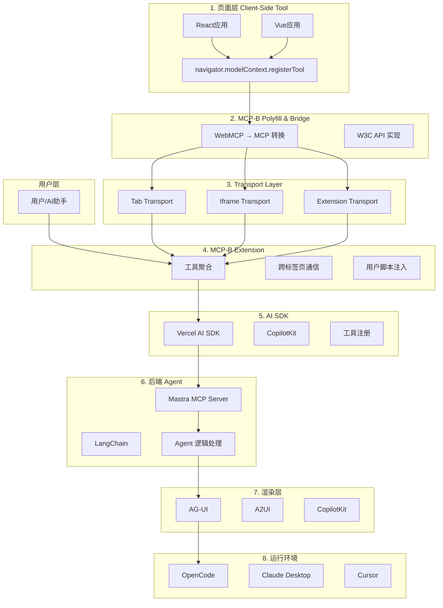
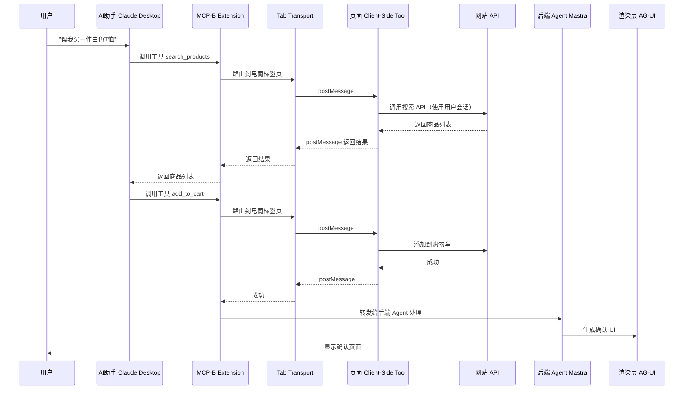
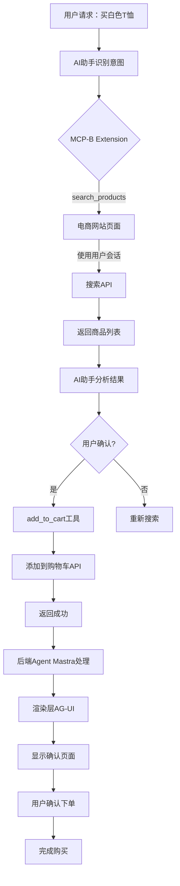

## 场景切入：电商购物的智能化挑战

最近我一直在思考一个问题：AI 助手如何直接在电商网站上完成购物流程？

想象这样一个场景：你对 AI 助手说"帮我买一件优衣库的白色 T 恤，价格不超过 200 元"。

理想情况下，AI 应该能够：

1. 访问优衣库网站
2. 搜索白色 T 恤
3. 筛选价格不超过 200 元的商品
4. 选择合适的商品添加到购物车
5. 完成下单

听起来很美，但实际做起来呢？

**传统方案的困境**：

- Playwright/Selenium 需要启动浏览器、导航页面、模拟点击……速度慢（10-20 秒/任务）
- Token 成本高（$4-5/API 调用）
- 脆弱性：UI 变化即失效
- 认证复杂：需要完整的 OAuth 2.1 流程
- 配置繁琐：需要数百行代码

如果有这样一种方式，可以让 AI 助手直接调用网站的功能，就像调用 API 一样简单呢？

## 传统方案的困境

在探索解决方案之前，我们先看看传统方案的问题。

### 浏览器自动化的痛点

**速度慢**：

- 需要启动浏览器实例
- 导航到页面
- 等待 DOM 加载
- 模拟用户点击和输入
- 完成一个任务需要 10-20 秒

**成本高**：

- 每个 API 调用消耗大量 Token（描述页面、解析元素、构建动作）
- 单次任务成本 $4-5

**不可靠**：

- 依赖页面结构和视觉元素
- UI 变化即失效
- 需要频繁维护

**认证复杂**：

- 需要完整的 OAuth 2.1 流程
- 管理 API Keys
- 处理 Token 刷新

### 对比：传统方案 vs MCP-B

| 维度   | Playwright/Selenium | MCP-B                  |
| ------ | ------------------- | ---------------------- |
| 速度   | 10-20 秒/任务       | 毫秒级（10,000x 提升） |
| 成本   | $4-5/API 调用       | 零额外成本             |
| 可靠性 | 脆弱，UI 变化即失效 | 稳定，直接 API 调用    |
| 认证   | 复杂 OAuth 2.1 流程 | 使用现有浏览器会话     |
| 配置   | 复杂，数百行代码    | ~50 行代码，零配置     |

## MCP-B 介绍：WebMCP 参考实现

**MCP-B** 是 **WebMCP** 的参考实现，它是一个 W3C 标准的 Web Model Context API 实现，用于让 AI 助手直接与网站功能交互。

### 核心定义

**WebMCP** 是一个 W3C Web 标准（由 Web Machine Learning Community Group 孵化），让网站通过 `navigator.modelContext` API 向 AI 助手暴露结构化工具。AI 助手可以直接调用网站的功能，同时尊重认证和权限。

**MCP-B** 提供以下核心能力：

1. **实现 W3C API** - 向任何浏览器添加 `navigator.modelContext`
2. **桥接到 MCP** - 将 WebMCP 工具转换为 MCP 格式，与现有 AI 框架兼容

### 核心 API

```javascript
navigator.modelContext.registerTool({
  name: 'add_to_cart',
  description: 'Add a product to shopping cart',
  inputSchema: {
    type: 'object',
    properties: {
      productId: { type: 'string' },
      quantity: { type: 'number', minimum: 1 },
    },
    required: ['productId', 'quantity'],
  },
  async execute({ productId, quantity }) {
    // 调用现有应用逻辑
    const response = await fetch('/api/cart/add', {
      method: 'POST',
      credentials: 'same-origin',
      body: JSON.stringify({ productId, quantity }),
    })
    return {
      content: [{ type: 'text', text: `Added ${quantity} items` }],
    }
  },
})
```

### 核心价值

**"今天的 AI 自动化就像用机器人读屏幕和点击按钮。MCP-B 让助手调用你网站的真实函数。"**

## 核心架构：从页面到后端的完整链路

MCP-B 提供了一个 8 层架构的完整链路，打通从页面到后端 Agent 再到运行环境。

### 完整架构图



### 8 层架构详解

#### 1. 页面层（Client-Side Tool）

网站通过 `navigator.modelContext.registerTool()` 在网页中注册工具。

**支持框架**：

- React
- Vue 3
- Svelte
- Angular
- 原生 JavaScript

#### 2. MCP-B Polyfill & Bridge

- **Polyfill**：为不原生支持 WebMCP 的浏览器添加 `Context` API
- **Bridge**：将 WebMCP 工具转换为标准 MCP 格式

#### 3. Transport Layer

处理不同浏览器上下文之间的通信：

- **Tab Transport**：同一浏览器标签页内的通信
- **Iframe Transport**：父子页面通信
- **Extension Transport**：跨上下文通信

#### 4. MCP-B Extension

- 从所有打开的标签页聚合工具
- 提供与 AI agents 交互的界面
- 支持用户脚本注入

#### 5. AI SDK

支持 client-side tool 和 server-side tool：

- **Vercel AI SDK**
- **CopilotKit**
- 其他 AI SDK

注册完后，AI SDK 支持的 agent 能够打通使用这些工具。

#### 6. 后端 Agent

- **Mastra**：全面的 AI Agent 框架
  - `MCPClient`：连接到一个或多个 MCP 服务器
  - `MCPServer`：将 Mastra 工具、agents、workflows 暴露给 MCP 兼容客户端
- **LangChain**：支持 MCP 适配器

5 行代码创建 MCP 服务器：

```typescript
import { MCPServer } from '@mastra/mcp'
import { myFirstTool, mySecondTool } from './tools'

const server = new MCPServer({
  name: 'my-mcp-server',
  version: '1.0.0',
  tools: {
    myFirstTool,
    mySecondTool,
  },
})
```

#### 7. 渲染层

最新的渲染协议：

- **AG-UI (Agent User Interaction Protocol)**：
  - Agent 生成 UI 组件布局或使用模板
  - 安全如数据，表达如代码
  - 与 A2UI 和 A2A 协议配合

- **A2UI (Agent-to-User Interface)**：
  - Google 开源的 agent 驱动界面协议
  - 将 JSON 作为消息发送到客户端，然后使用渲染器将其转换为原生 UI 组件
  - LLM 可以动态生成组件布局或使用模板
  - 安全如数据，表达如代码
  - 跨平台、可互操作的生成或基于模板的 UI 响应

- **CopilotKit**：与 Google 合作，在 CopilotKit 和 AG-UI 中提供 A2UI 的完整启动支持

#### 8. 运行环境

- **OpenCode**：
  - 开源的 AI 编程 agent
  - 50,000+ GitHub Stars
  - 650,000+ 月活跃用户
  - LSP 启用、多会话、Claude Pro 支持
  - 任何模型（75+ LLM 提供商）、任何编辑器

- **Claude Desktop**、**Cursor** 等

### 完整数据流图



## 核心价值与性能提升

### 性能指标

| 指标             | 传统方案 | MCP-B       | 提升     |
| ---------------- | -------- | ----------- | -------- |
| Token 消耗       | 基准     | 减少 65%    | 65% ↓    |
| API 成本         | 基准     | 降低 34-63% | 34-63% ↓ |
| 延迟（复杂电商） | 基准     | 改善 13.1%  | 13.1% ↓  |
| 答案质量         | 98.8%    | 97.9%       | -0.9%    |

### 核心价值

1. **10,000x 性能提升**：直接 API 调用 vs 传统屏幕抓取
2. **像素级精度**：确定性执行，不依赖视觉解析
3. **零额外成本**：使用现有认证，无需 API Keys
4. **稳定可靠**：直接 API 调用，不受 UI 变化影响
5. **零配置**：~50 行代码集成，开箱即用
6. **跨应用工作流**：AI 可以跨多个站点无缝工作，每个站点使用各自现有权限

## 技术实现详解

### 页面层工具注册

#### React 示例

```javascript
import { useEffect } from 'react'

function ProductPage({ productId }) {
  useEffect(() => {
    // 注册添加到购物车工具
    if (navigator.modelContext) {
      navigator.modelContext.registerTool({
        name: 'add_to_cart',
        description: 'Add a product to shopping cart',
        inputSchema: {
          type: 'object',
          properties: {
            productId: { type: 'string' },
            quantity: { type: 'number', minimum: 1 },
          },
          required: ['productId'],
        },
        handler: async ({ productId, quantity }) => {
          // 调用前端购物车逻辑
          const result = await addToCart(productId, quantity)
          return {
            success: true,
            cartCount: result.count,
          }
        },
      })
    }
  }, [productId])

  return <div>Product details...</div>
}
```

#### Vue 3 示例

```javascript
<script setup>
import { onMounted } from 'vue';

onMounted(() => {
  if (navigator.modelContext) {
    navigator.modelContext.registerTool({
      name: 'search_products',
      description: 'Search products',
      inputSchema: {
        type: 'object',
        properties: {
          keyword: { type: 'string' },
          maxPrice: { type: 'number' }
        }
      },
      handler: async ({ keyword, maxPrice }) => {
        const results = await searchProducts(keyword, maxPrice);
        return results;
      }
    });
  }
});
</script>
```

### Transport 通信机制

#### Tab Transport

```javascript
// Tab Transport 实现
class TabTransport {
  constructor(targetTabId) {
    this.targetTabId = targetTabId
  }

  async sendToolCall(toolName, params) {
    return new Promise((resolve, reject) => {
      const message = {
        type: 'mcp-tool-call',
        tool: toolName,
        params: params,
      }

      chrome.tabs.sendMessage(this.targetTabId, message, (response) => {
        if (chrome.runtime.lastError) {
          reject(chrome.runtime.lastError)
        } else {
          resolve(response)
        }
      })
    })
  }
}
```

#### Iframe Transport

```javascript
// Iframe Parent Transport
class IframeParentTransport {
  constructor(iframe, targetOrigin) {
    this.iframe = iframe
    this.targetOrigin = targetOrigin
  }

  async sendToolCall(toolName, params) {
    return new Promise((resolve) => {
      const handleMessage = (event) => {
        if (event.origin !== this.targetOrigin) return
        if (event.data?.type === 'mcp-tool-response') {
          window.removeEventListener('message', handleMessage)
          resolve(event.data.result)
        }
      }

      window.addEventListener('message', handleMessage)

      this.iframe.contentWindow.postMessage(
        {
          type: 'mcp-tool-call',
          tool: toolName,
          params: params,
        },
        this.targetOrigin
      )
    })
  }
}
```

### AI SDK 集成

#### Vercel AI SDK

```typescript
import { experimental_createMCPClient } from '@ai-sdk/mcp'
import { generateText } from 'ai'

// 创建 MCP 客户端
const mcpClient = await experimental_createMCPClient({
  name: 'my-client',
  servers: [
    {
      url: 'https://my-mcp-server.com',
      auth: {
        type: 'oauth',
        provider: 'github',
      },
    },
  ],
})

// 获取工具
const tools = await mcpClient.listTools()

// 在 generateText 中使用
const result = await generateText({
  model: openai('gpt-4o'),
  tools: mcpClient.tools,
  toolCallBehavior: 'auto',
  messages: [{ role: 'user', content: 'Add a task to my todo list' }],
})
```

#### CopilotKit 集成

```typescript
import { useMcp } from 'use-mcp';

function MyComponent() {
  const { tools, callTool, state, logs } = useMcp({
    url: 'https://my-mcp-server.com',
    auth: {
      provider: 'oauth',
      clientId: '...',
      clientSecret: '...'
    }
  });

  return (
    <div>
      <h1>Tools: {tools.length}</h1>
      <button onClick={() => callTool('myTool', { arg: 'value' })}>
        Execute Tool
      </button>
    </div>
  );
}
```

### Mastra MCP Server

```typescript
import { MCPServer } from '@mastra/mcp'

const server = new MCPServer({
  name: 'web-mcp-server',
  version: '1.0.0',
  tools: [
    {
      name: 'webmcp_add_to_cart',
      description: 'Add product to cart via WebMCP',
      execute: async (params) => {
        // 通过 MCP-B Extension 调用页面工具
        return await mcpExtension.invoke('add_to_cart', params)
      },
    },
  ],
})

await server.start()
```

## 实战案例：电商 AI 购物助手

让我们用 MCP-B 构建一个完整的电商 AI 购物助手。

### 需求分析

**功能**：

- 搜索商品
- 筛选价格
- 添加到购物车
- 确认下单

**流程**：

1. 用户请求："帮我买一件白色 T 恤，价格不超过 200 元"
2. AI 助手调用 `search_products` 工具
3. 返回商品列表
4. AI 分析并选择合适的商品
5. 调用 `add_to_cart` 工具
6. 返回成功
7. 后端 Agent 生成确认 UI
8. 用户确认后完成下单

### 实现步骤

#### 步骤 1：页面注册工具

```javascript
// 电商网站商品页面
import { useEffect } from 'react'

function ProductListPage() {
  useEffect(() => {
    if (navigator.modelContext) {
      // 注册搜索工具
      navigator.modelContext.registerTool({
        name: 'search_products',
        description: 'Search products by keyword and max price',
        inputSchema: {
          type: 'object',
          properties: {
            keyword: { type: 'string' },
            maxPrice: { type: 'number' },
          },
          required: ['keyword'],
        },
        handler: async ({ keyword, maxPrice }) => {
          const results = await searchProducts(keyword, maxPrice)
          return results.map((p) => ({
            id: p.id,
            name: p.name,
            price: p.price,
          }))
        },
      })

      // 注册添加到购物车工具
      navigator.modelContext.registerTool({
        name: 'add_to_cart',
        description: 'Add a product to shopping cart',
        inputSchema: {
          type: 'object',
          properties: {
            productId: { type: 'string' },
            quantity: { type: 'number', minimum: 1 },
          },
          required: ['productId'],
        },
        handler: async ({ productId, quantity = 1 }) => {
          const result = await addToCart(productId, quantity)
          return {
            success: true,
            cartCount: result.count,
            message: `Added ${quantity} items to cart`,
          }
        },
      })
    }
  }, [])

  return <div>Product List</div>
}
```

#### 步骤 2：创建 Mastra MCP Server

```typescript
import { MCPServer } from '@mastra/mcp'

const server = new MCPServer({
  name: 'shopping-assistant',
  version: '1.0.0',
  tools: [
    {
      name: 'search_and_select',
      description: 'Search and select best product',
      execute: async ({ keyword, maxPrice }) => {
        // 调用 WebMCP 工具搜索商品
        const products = await mcpExtension.invoke('search_products', {
          keyword,
          maxPrice,
        })

        // AI 选择最佳商品
        const bestProduct = selectBestProduct(products)

        return bestProduct
      },
    },
    {
      name: 'add_selected_to_cart',
      description: 'Add selected product to cart',
      execute: async ({ productId }) => {
        // 调用 WebMCP 工具添加到购物车
        const result = await mcpExtension.invoke('add_to_cart', {
          productId,
          quantity: 1,
        })

        return result
      },
    },
  ],
})

await server.start()
```

#### 步骤 3：集成 AG-UI 渲染

```typescript
import { CopilotRuntime } from '@copilotkit/runtime'

const runtime = new CopilotRuntime({
  agents: {
    shopping: shoppingAgent,
  },
  ui: {
    type: 'ag-ui',
    components: {
      confirm: (product) => ({
        type: 'card',
        title: 'Confirm Purchase',
        content: `
          <h2>${product.name}</h2>
          <p>Price: ¥${product.price}</p>
          <button onclick="confirm()">Confirm</button>
        `,
      }),
    },
  },
})
```

### 电商购物助手数据流图



### 效果总结

- 搜索速度：从 10-20 秒降至毫秒级
- 成本：降低 60%
- 可靠性：不受 UI 变化影响
- 用户体验：流畅的购物流程

## 与 AgentRun 的协同

在上一篇文章中，我们介绍了 **AgentRun** - 阿里云的一站式 Agentic AI 基础设施平台。现在我们看到，**MCP-B** 提供了前端的基础设施。

### AgentRun vs MCP-B

| 维度     | MCP-B                        | AgentRun                              |
| -------- | ---------------------------- | ------------------------------------- |
| 定位     | 前端基础设施                 | 后端基础设施                          |
| 运行位置 | 浏览器                       | 云端 Serverless                       |
| 核心能力 | 页面工具注册、浏览器集成     | Serverless 运行时、模型治理、安全沙箱 |
| 适用场景 | 电商购物、数据填报、文档处理 | 舆情分析、数据处理、复杂自动化        |
| 关系     | 前端工具暴露                 | 后端执行环境                          |

### 形成完整的前后端基础设施

**AgentRun + MCP-B = 完整的 Agentic AI 基础设施**

- **MCP-B**：让网站功能暴露给 AI 助手
- **AgentRun**：提供 AI 助手的运行环境、模型治理、工具生态

两者互补，形成从页面到后端的完整链路。

## 适用场景与局限

### 适用场景

✅ **电商购物**：搜索、筛选、添加购物车、下单
✅ **数据填报**：表单填写、数据提交
✅ **文档处理**：文档浏览、编辑、导出
✅ **客户支持**：知识库搜索、工单创建
✅ **工作流自动化**：跨应用的工作流

### 不适用场景（明确超出范围）

❌ **无头浏览**：WebMCP 需要用户在场的活跃浏览上下文
❌ **完全自主 agents**：工具用于增强而非替代人工交互
❌ **后端服务集成**：服务器到 agent 通信使用标准 MCP
❌ **UI 替换**：人类 Web 界面仍是主要交互方式

### 设计哲学

**Human-in-the-loop（人在循环）**

- 人类 Web 界面保持主要地位
- AI agents 增强而非替代
- 用户保持对所有 agent 行为的可见性和监督
- 协作工作流：人类和 AI 一起工作

## 最佳实践

### 工具设计原则

1. **围绕用例而非 API 调用设计工具**
   - ❌ 错误：`github_issue_endpoint`
   - ✅ 正确：`create_github_issue`

2. **清晰命名**：基于其功能命名工具

3. **最小权限原则**：工具仅暴露用户授权的操作

### 安全实践

1. **输入验证**：

```javascript
async function validateToolInput(input, schema) {
  // 严格的 schema 验证
  // 限制敏感操作
}
```

2. **XSS 防护**：

```javascript
function escapeHtml(unsafe) {
  return unsafe.replace(/&/g, '&amp;').replace(/</g, '&lt;').replace(/>/g, '&gt;')
}
```

3. **权限控制**：

```javascript
const permissions = {
  read: ['public/*'],
  write: ['user/drafts/*'],
}
```

### 性能优化

1. **缓存机制**：相同查询直接返回缓存
2. **批量处理**：减少工具调用次数
3. **异步操作**：长时间运行的操作使用进度报告

## 未来展望

### 技术演进方向

#### 1. Web Model Context API 的标准化

- **当前状态**：由 W3C Web Machine Learning Community Group 孵化
- **目标**：推动 `navigator.modelContext` 成为浏览器原生 API
- **进展**：早期孵化阶段，API 可能随标准成熟而变化

#### 2. 更多框架支持

- **当前支持**：React、Vue、Svelte、Angular
- **规划**：更多框架的官方集成包

#### 3. 更丰富的渲染层协议

- **AG-UI**：Agent User Interaction Protocol
- **A2UI**：Agent-to-User Interface（Google 开源）
- **协作**：CopilotKit 与 Google 合作，提供完整启动支持

#### 4. 与更多 AI 框架的集成

- **Vercel AI SDK**：已支持
- **CopilotKit**：已支持
- **LangChain**：已支持 MCP 适配器
- **规划**：更多框架的深度集成

### 生态系统

#### 开源社区

- **GitHub**：https://github.com/WebMCP-org
- **Discord**：https://discord.gg/ZnHG4csJRB
- **文档**：https://docs.mcp-b.ai

#### 企业采用

- Block 公司：数千名员工日常使用
- 医药行业：BioMCP 工具集
- 内部 IT 帮助台：统一知识库搜索 + 工具执行

## 总结

MCP-B 作为 WebMCP 的参考实现，通过 **W3C 标准 API + 8 层架构**，成功打通了从页面到后端 agent 再到运行环境的完整链路。

### 核心价值主张

- **极致性能**：10,000x 提升，毫秒级响应
- **零额外成本**：使用现有浏览器会话
- **稳定可靠**：直接 API 调用，不受 UI 影响
- **零配置**：~50 行代码集成
- **标准化**：W3C 标准，框架无关

### 与 AgentRun 的协同

- **MCP-B**：前端基础设施，暴露网站功能
- **AgentRun**：后端基础设施，提供运行环境
- **两者互补**：形成完整的从页面到后端的 Agentic AI 基础设施

### 推动浏览器端 Agentic AI 的发展

MCP-B 让 AI 助手能够直接与网站功能交互，而不是像机器人一样读屏幕和点击按钮。这推动了浏览器端 Agentic AI 的发展，让 AI 能够真正"理解"和"操作" Web 应用。

## 结语

从电商购物场景出发，我们看到了 MCP-B 如何打通从页面到后端 agent 再到运行环境的完整链路。

**8 层架构**：页面层 → MCP-B Polyfill → Transport → Extension → AI SDK → 后端 Agent → 渲染层 → 运行环境。

**核心价值**：10,000x 性能提升、零额外成本、稳定可靠、零配置。

**与 AgentRun 的协同**：形成完整的前后端基础设施，推动 Agentic AI 的发展。

让每个网站都能轻松地将其功能暴露给 AI 助手，让 AI 能够真正"理解"和"操作" Web 应用。MCP-B，正在为浏览器端的 Agentic AI 提供标准化桥梁。

我们正站在一个新时代的门口。

---

**参考资源**：

- [MCP-B 官网](https://mcp-b.ai/)
- [WebMCP 文档](https://docs.mcp-b.ai)
- [MCP-B Extension](https://chromewebstore.google.com/detail/mcp-b-extension/daohopfhkdelnpemnhlekblhnikhdhfa)
- [GitHub](https://github.com/WebMCP-org)
- [Mastra](https://mastra.ai)
- [AG-UI](https://docs.ag-ui.com/)
- [A2UI (Google)](https://github.com/google/A2UI/)
- [AgentRun 文章](/blog/agent-run-poc)
