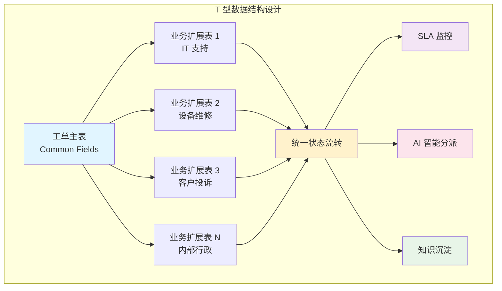
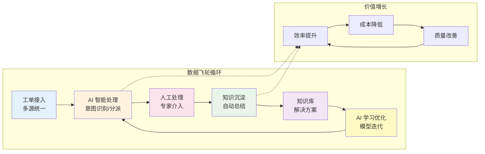
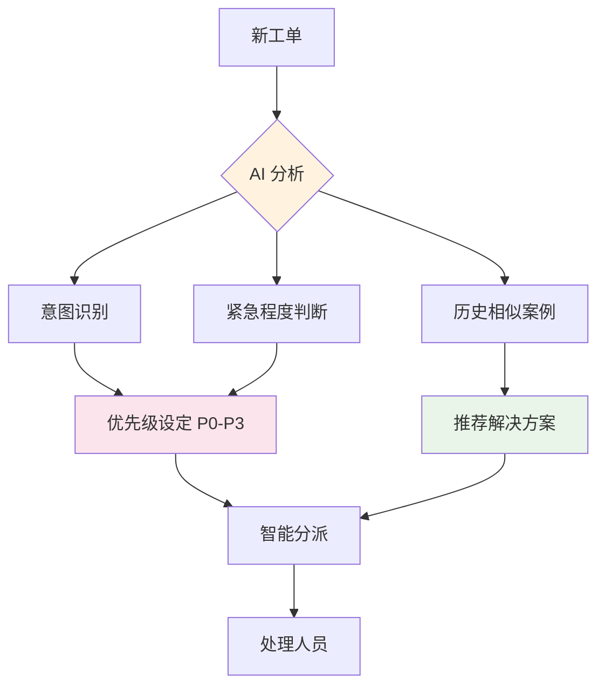
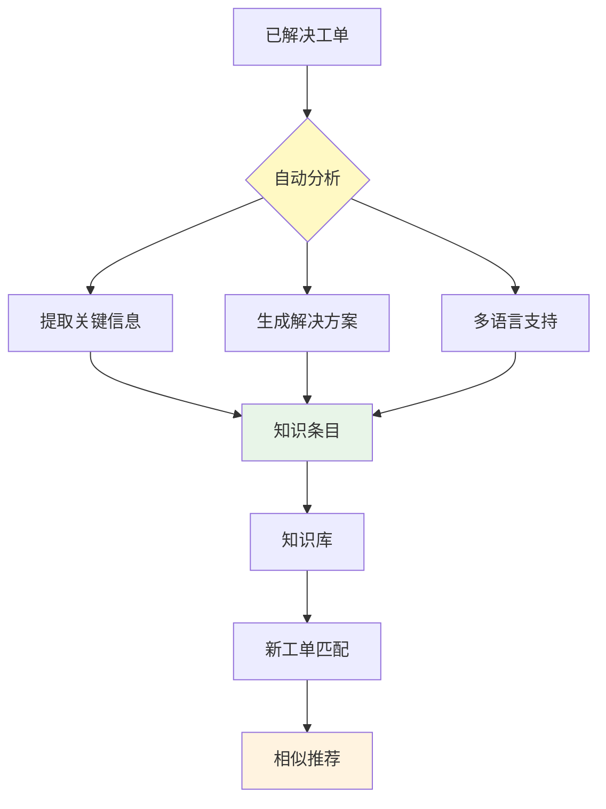
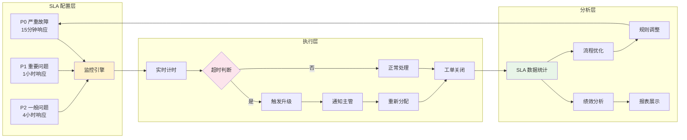
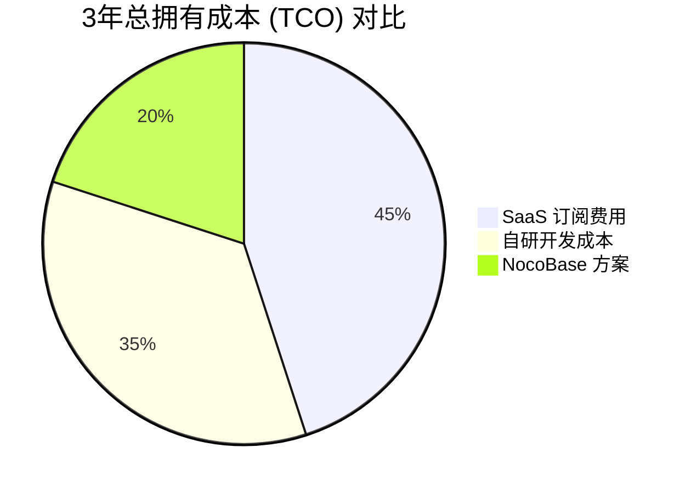
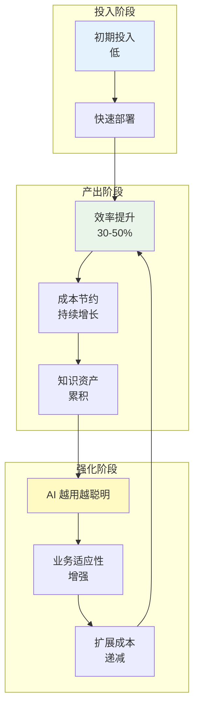
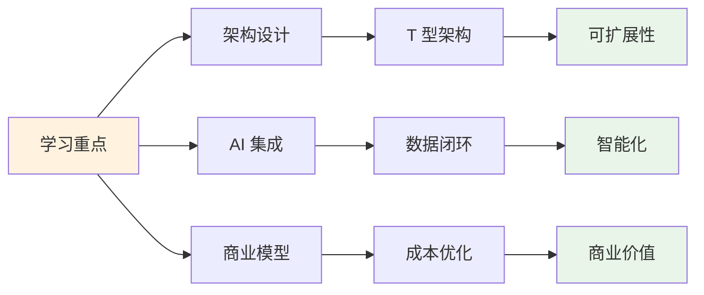

## 前言：为什么学习这个项目？

在 AI 应用落地的浪潮中，**NocoBase 智能工单系统** 展现了一个极具代表性的商业案例。它不仅仅是一个简单的 AI 功能叠加，而是将 AI 深度融入业务流程，构建了一个完整的**数据闭环飞轮**。

本文将深度解析这个项目的核心设计思路，重点包括：

- 🏗️ **T 型数据架构**：可扩展的数据模型设计
- 🔄 **AI 数据闭环飞轮**：如何让系统越用越聪明
- 💼 **商业落地实践**：从 SaaS 到自研的最优解
- 🎨 **Mermaid 图解**：可视化理解系统架构

---

## 项目概览

> **项目名称**：NocoBase 智能工单系统
> **技术栈**：NocoBase 2.0 + AI 能力集成
> **核心定位**：可扩展、可配置、AI 原生的工单系统架构
> **目标**：让企业以更低的成本，构建灵活、可扩展、完全自主可控的工单系统

### 官方资源

- 📖 [解决方案介绍](https://www.nocobase.com/cn/solutions/ticketing-v2)
- 📚 [技术文档](https://v2.docs.nocobase.com/cn/solution/ticket-system/)
- 🎮 [Demo 体验](https://demo.nocobase.com/new)

---

## 传统工单系统的痛点分析

### 1. SaaS 工单系统的局限性

```
SaaS 工单系统
├── 优点：上手快、功能齐全
├── 缺点：
│   ├── 流程字段定制能力有限 ⚠️
│   ├── AI 能力停留在"点缀"层面 🎨
│   ├── 数据和业务逻辑不完全可控 🔒
│   └── 成本随团队规模持续增长 💸
```

### 2. 自研系统的现实困境

```
自研工单系统
├── 优点：完全灵活可控
├── 缺点：
│   ├── 开发周期长、成本高 ⏰
│   ├── 维护依赖原开发人员 👤
│   ├── 流程变化需重新开发 🔄
│   └── 经验难以产品化沉淀 📦
```

---

## NocoBase 的核心创新：T 型数据架构

### 架构图解



### 架构优势解析

| 维度             | 传统方案       | NocoBase 方案  |
| ---------------- | -------------- | -------------- |
| **新增业务类型** | 需改动核心代码 | 只需创建扩展表 |
| **字段定制**     | 受限或高成本   | 自由配置       |
| **核心逻辑**     | 分散在各业务   | 统一维护       |
| **扩展成本**     | 高             | **极低** ✅    |

---

## AI 驱动的数据闭环飞轮

这是整个系统最核心的创新点。AI 不是简单的功能叠加，而是深度参与业务流程，形成**自我强化的数据飞轮**。

### 飞轮循环图解



### 飞轮各环节详解

#### 1️⃣ **工单接入 - 多源统一**

```
接入渠道：
├── 对外/内部表单
├── 邮件自动解析 📧
├── API / Webhook
└── 客服/运维代录

统一处理：
├── 来源识别
├── 重复检测
├── 基础信息补全
└── 进入统一流转体系
```

#### 2️⃣ **AI 智能处理 - 深度参与**



#### 3️⃣ **知识沉淀 - 自动进化**



---

## SLA 驱动的流程闭环

### SLA 监控架构



---

## 商业落地价值分析

### 成本对比模型



### ROI 飞轮效应



---

## 关键设计亮点

### 1. **可扩展性优先**

- **T 型架构**：核心统一，业务可扩展
- **配置驱动**：90% 需求通过配置解决
- **插件化**：按需加载功能模块

### 2. **AI 原生设计**

- **不是补丁**：AI 融入核心流程
- **数据闭环**：越用越聪明的飞轮
- **人机协作**：AI 辅助，人做决策

### 3. **商业可行性**

- **快速落地**：分钟级部署
- **成本可控**：无需数百万投入
- **自主可控**：数据完全私有

---

## 学习要点总结

### 架构设计启示

1. **数据模型设计**：T 型结构平衡统一性与灵活性
2. **AI 集成模式**：从功能到流程的深度融入
3. **飞轮效应**：构建自我强化的数据闭环

### 商业落地启示

1. **成本模型**：TCO 对比揭示真实价值
2. **扩展性**：降低长期维护成本
3. **自主可控**：数据资产私有化

### 技术实现启示



---

## 延伸思考

### 1. 这个模式能否复用到其他场景？

- **CRM 系统**：客户管理 + AI 洞察
- **项目管理**：任务流转 + 智能分配
- **供应链**：订单处理 + 预测优化

### 2. AI 在业务系统中的演进路径

```
阶段 1: AI 作为功能点缀 (聊天机器人)
阶段 2: AI 参与部分流程 (自动分类)
阶段 3: AI 驱动核心流程 (智能分派)
阶段 4: AI 形成数据闭环 (自我进化) ← NocoBase
阶段 5: AI 主导业务决策 (未来方向)
```

### 3. 开源项目的学习价值

NocoBase 展示了如何：

- **平衡开源与商业**：核心开源，增值服务
- **技术驱动业务**：架构创新带来商业优势
- **社区共建**：反馈驱动产品迭代

---

## 参考资源

### 官方渠道

- 🏠 [NocoBase 官网](https://www.nocobase.com/cn)
- 📘 [技术文档](https://docs-cn.nocobase.com/)
- 💬 [社区论坛](https://forum.nocobase.com)
- 🐙 [GitHub 仓库](https://github.com/nocobase/nocobase)

### 延伸阅读

- [AI 在企业服务中的应用趋势](#)
- [低代码平台的架构设计](#)
- [数据闭环飞轮理论](#)

---

## 结语

NocoBase 智能工单系统不仅是一个优秀的开源项目，更是 AI 商业落地的典范案例。它告诉我们：

> **真正的 AI 落地，不是简单的功能叠加，而是业务流程的重构与数据闭环的构建。**

通过学习这个项目，我们可以获得：

- ✅ 可复用的架构设计模式
- ✅ AI 与业务深度融合的思路
- ✅ 商业化落地的实践经验
- ✅ 开源项目运营的启示

这正是我们在 "AI 项目学习与商业落地" 系列中，希望通过深度解析优秀项目，帮助大家找到 AI 应用落地的最佳实践路径。

---

**系列预告**：下一篇我们将深入分析另一个 AI 商业落地案例，敬请期待！

> **学习建议**：建议亲自部署 NocoBase，体验完整的智能工单流程，实践是最好的学习方式。
