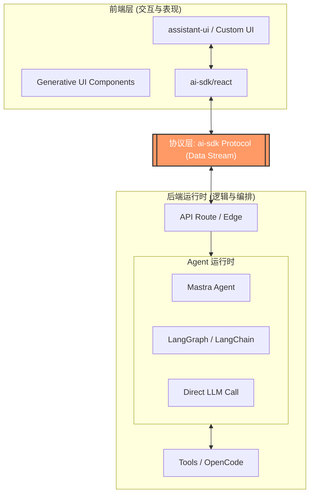
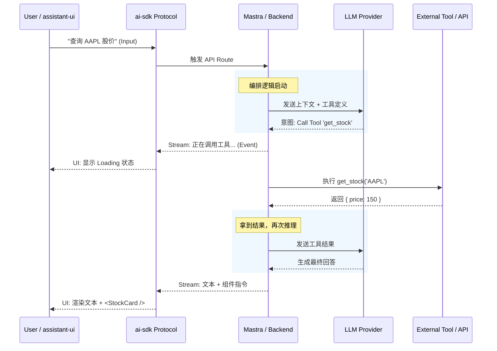
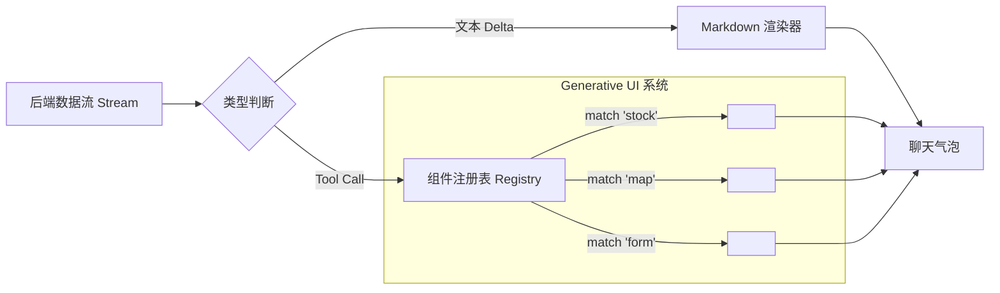

# 现代 AI Agent 应用架构指北：从协议标准到生产级基建

在 AI 应用从单纯的 "Chatbot" 向复杂的 "Agentic Workflow"（代理工作流）演进的过程中，开发者面临的最大挑战不再是如何调用 API，而是如何治理**复杂性**：多模型切换的碎片化、工具调用的异步性、流式渲染的延迟以及生产环境的稳定性。

本文介绍一套目前业界公认的最佳实践架构：以 **Vercel AI SDK 为协议核心**，解耦前端表现（**assistant-ui**）与后端逻辑（**Mastra/LangGraph**），构建可扩展、可观测的生产级 AI 应用。

## 一、 全局架构概览：沙漏模型

我们可以将现代 AI 应用视为一个“沙漏”结构：中间窄且标准化，两端宽且灵活。

- **上层（UI/交互）：** 极度灵活，支持 Generative UI、多模态交互。
- **中层（协议/传输）：** **Vercel AI SDK**。这是唯一的收束点，标准化的“防腐层”。
- **下层（大脑/编排）：** 极度多样，支持 Mastra, LangGraph, OpenCode 等多种运行时。



## 二、 中枢神经：AI SDK 与 Data Stream Protocol

**Vercel AI SDK** 在此架构中并非简单的 HTTP 库，它扮演了 **“USB Type-C 标准接口”** 的角色。

1. **防腐层 (Anti-Corruption Layer):** 它抹平了 OpenAI, Anthropic, Google 等不同模型提供商的接口差异。你的业务代码只需面向 `LanguageModel` 接口编程。
2. **Data Stream Protocol (数据流协议):** 这是核心资产。它定义了一套能承载**文本、工具调用 (Tool Call)、工具回执 (Tool Result) 和中间状态**的流式标准。

### 交互时序图：协议如何驱动工作流

下图展示了从用户提问到 Agent 思考、调用工具、再到前端渲染的完整“往返”过程（Roundtrip）：



## 三、 大脑与手脚：Agent 编排层

在协议层之下，是真正的业务逻辑所在地。根据业务复杂度，我们可以灵活选择后端策略：

- **Mastra / LangGraph (复杂编排):**
- 处理 **HITL (Human-in-the-Loop)**：例如删除数据前暂停，等待前端确认。
- **关键适配：** 必须将 Agent 框架内部的 Event（如“正在搜索”、“正在阅读”）映射为 AI SDK 的 `StreamData`，解决“黑盒”等待焦虑。

- **OpenCode (代码解释器):**
- 提供沙箱环境执行 Python/JS 代码，用于数据分析或绘图。

- **Frontend Direct (端侧直连):**
- 对于简单的文案生成，前端可以直接通过 AI SDK 连接 Provider，降低延迟。

## 四、 皮肤与面孔：assistant-ui 与 Generative UI

**assistant-ui** 是专为 AI SDK 协议设计的容器。它不负责逻辑，只负责**渲染**。

- **Generative UI (生成式 UI):**
  这是体验的分水岭。Agent 不应只返回文本，而应返回**界面**。
- **机制：** 后端下发 Tool Call 前端 `assistant-ui` 拦截 匹配 Registry 渲染 React 组件。



## 五、 生产级基建：从 Demo 到 Production

跑通代码只是完成了 60%，剩下的 40% 在于基础设施。一个稳健的架构必须包含**网关、持久化和可观测性**。

### 完整的生产级拓扑图

```mermaid
graph TB
    Client[客户端 App] --> API[API Gateway / Load Balancer]

    subgraph "应用层 (App Server)"
        API <--> AI_SDK[ai-sdk Core]
        AI_SDK <--> Logic[Mastra / LangGraph Logic]
    end

    subgraph "治理与监控 (Ops Layer)"
        Logic --> AIGw["AI Gateway (Helicone/Portkey)"]
        Logic -.-> Tracing[可观测性 (LangSmith)]
        API -.-> Auth[鉴权 (Clerk/NextAuth)]
    end

    subgraph "数据层 (Persistence)"
        Logic --> VectorDB[(Vector DB / RAG)]
        API --> SessionDB[(Postgres - 会话历史)]
    end

    subgraph "模型层 (Providers)"
        AIGw --> OpenAI
        AIGw --> Anthropic
        AIGw --> LocalLLM[Ollama/vLLM]
    end

```

### 关键组件说明：

1. **AI Gateway:** 统一管理 API Keys，实现缓存（Caching）和模型自动降级（Fallback）。
2. **持久化:** `ai-sdk` 状态是临时的，必须引入数据库存储 `chat_id` 和 `messages` 以实现历史回溯。
3. **可观测性:** 集成 LangSmith 或 OpenTelemetry，分析 Agent 在哪一步卡住，不仅看结果，更要看过程。

## 六、 总结

这套架构的核心哲学是 **“标准化协议，模块化实现”**：

1. **前端** 专注交互体验与组件映射 (`assistant-ui` + Generative UI)。
2. **传输** 严格遵守标准协议 (`ai-sdk`)。
3. **后端** 专注业务编排与智能涌现 (`Mastra`/`LangGraph`)。
4. **基建** 保障稳定性与可观测性。

通过这种方式，团队可以在保持技术栈先进性的同时，灵活地替换底层的模型或顶层的 UI 库，构建出既聪明又健壮的 AI 应用。
