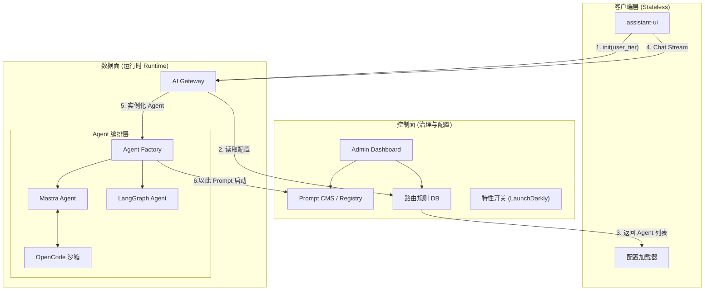
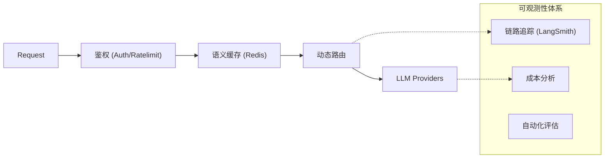

这篇文章基于我们之前的深度探讨，将视角从“如何构建一个 Agent”提升到了“如何架构一个可演进的 AI 平台”。

我们将核心理念定调为：**数据面（Data Plane）追求极致的流式标准化，控制面（Control Plane）追求完全的动态配置化。**

# 现代 AI 架构进化论：无状态前端与控制面治理

在 AI 应用开发的 1.0 时代，我们关注的是 Prompt Engineering 和模型调用。到了 2.0 时代，随着 Agentic Workflow（代理工作流）的兴起，工程复杂度呈指数级上升。

如何构建一个既能承载复杂编排（Mastra/LangGraph），又能灵活适应业务变化，且具备生产级稳定性的架构？答案在于**分离**：不仅是前后端分离，更是**运行时（Runtime）与配置态（Configuration）的彻底分离**。

本文将介绍一套经过验证的最佳实践架构：**“无状态前端 + 标准化协议 + 动态控制面”**。

## 一、 核心哲学：前端的“无状态”革命

传统的 Web 开发中，前端往往承载了大量业务逻辑。但在 AI 架构中，前端（Client）应当回归到 **“瘦客户端” (Thin Client)** 的定位。

**“前端无状态” (Frontend Statelessness)** 并非指 React 没有 State，而是指**前端不持有 Agent 的业务逻辑和配置信息**。

- **它不关心模型：** 不知道背后是 GPT-4 还是 Claude。
- **它不关心工具：** 不知道 `stock_chart` 组件何时会被触发。
- **它只做一件事：** 忠实地渲染来自后端的**协议流**。

这种设计使得 **assistant-ui** 成为一个纯粹的容器。当后端决定“切换模型”或“修改 Prompt”时，前端无需任何代码变更或重新部署。

## 二、 架构总览：数据面与控制面的二元对立

为了实现上述目标，我们将架构在逻辑上切割为两个平面：

1. **数据面 (Data Plane):** 负责**快**。处理高频的、实时的对话流传输。
2. **控制面 (Control Plane):** 负责**稳**。管理路由策略、Prompt 版本、工具权限等元数据。

## 三、 数据面：标准化协议流 (The Standardized Stream)

数据面关注的是“如何让不同的 Agent 通过同一根管道说话”。这里，**Vercel AI SDK** 是绝对的标准制定者（Protocol Owner）。

### 1. 协议即防腐层

无论后端是基于 **Mastra** 的复杂 ReAct 循环，还是基于 **LangGraph** 的多节点图，亦或是 **OpenCode** 的 Python 执行环境，它们必须统一输出 **AI SDK Data Stream Protocol**。

- **文本块 (0):** 正常的对话内容。
- **工具调用 (1/2):** 结构化的 JSON 指令。
- **中间状态 (Data):** 将 Agent 内部的 "Thinking...", "Searching..." 事件映射为协议数据，让前端感知过程。

### 2. Generative UI (生成式界面)

得益于协议的标准化，前端可以实现**“根据指令渲染”**。
后端下发 `{ tool: 'render_dashboard', data: {...} }`，前端 `assistant-ui` 动态查找并挂载 `<Dashboard />` 组件。这使得 UI 的展示完全由后端逻辑驱动，而非前端硬编码。

## 四、 控制面：动态治理体系 (The Governance Layer)

这是区分 Demo 和 SaaS 产品的关键。所有的**变化**都应发生在控制面，而非代码库中。

### 1. 动态路由 (Dynamic Routing)

- **场景：** 免费用户连 GPT-4o-mini，付费用户连 Claude-3.5，或者当 OpenAI 宕机时自动切模型。
- **实践：** 前端只发送 Context，网关层根据 `user_id` 和当前系统的健康状态，动态决定实例化哪个 Agent。

### 2. Prompt CMS 与热更新 (Hot-swapping)

- **痛点：** 避免每次修改 System Prompt 都要发版。
- **实践：** 将 Prompt 视为“内容”而非“代码”。Agent 启动时，从配置中心（Redis/Postgres 或 LangSmith Hub）拉取最新 Prompt。
- **优势：** 运营人员可以在后台调整 Prompt，点击发布，线上的 Agent 行为即刻改变，实现 **A/B 测试**。

### 3. 特性开关 (Feature Flags)

- **实践：** 使用 Feature Flags 管理 Agent 的能力边界。例如，只允许 Beta 组用户调用的 Agent 使用 `web_browsing` 工具。这些配置在 Agent 实例化时注入。

## 五、 基础设施：可观测性与鉴权

在控制面之下，是支撑系统运行的基石。

1. **AI Gateway:** 统一管理 API Key，处理重试、超时和熔断。
2. **持久化记忆:** `ai-sdk` 是临时的。必须引入向量数据库 (Vector DB) 和关系型数据库 (Postgres) 来存储会话历史和长期记忆。
3. **全链路追踪:** 集成 LangSmith 或 OpenTelemetry。由于 Agent 的行为是非确定性的，我们需要清晰地看到：输入是什么？检索了什么文档？工具参数对不对？为什么耗时这么久？

## 六、 总结

这套架构代表了目前 AI 工程化的前沿方向：

1. **Frontend:** 极致的**无状态 (Stateless)** 与 **配置驱动 (Config-Driven)**。
2. **Protocol:** 统一使用 **AI SDK** 标准流，抹平后端实现差异。
3. **Control Plane:** 引入 **CMS 和 动态配置**，将业务策略从代码中剥离。
4. **Backend:** 支持多运行时 (**Mastra/LangGraph**)，通过配置中心动态组装。

通过实施这套架构，团队不再是在“写代码”，而是在“编排平台”。你构建的不仅是一个聊天机器人，而是一个可以随业务需求动态演进的智能体生态系统。
