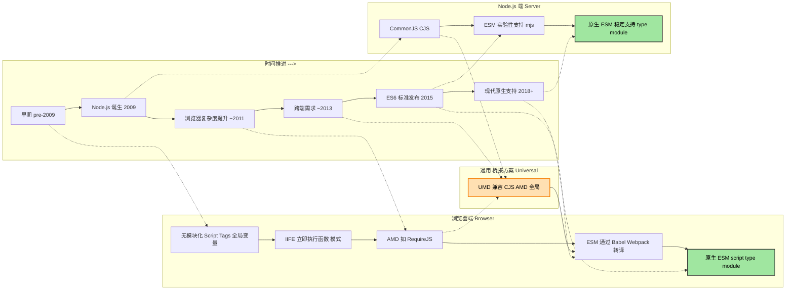

## 引言

JavaScript 模块化的发展史就是一部与"混乱"和"环境差异"斗争的历史。从早期的全局变量污染，到服务器端的 CommonJS，再到浏览器端的 AMD 和 UMD，最终到 ES Modules 的统一标准，每一步都解决了特定时代的问题。

本文将通过时间线的形式，清晰地展示浏览器端和 Node.js 端模块化标准的演进过程，并深入分析每种格式诞生的背景及其解决的核心问题。

---

## JavaScript 模块化发展时间线

我们用一个 Mermaid 流程图来表示这个时间线。请注意，时间线主要反映了它们**流行和被采纳的相对顺序**，而非严格的发布年份，因为很多标准是重叠发展的。



---

## 各阶段及模块化格式详解

下面详细介绍每种格式或模式的背景，以及它们是为了解决什么具体问题而诞生的。

### 1. 无模块化时代与 IIFE 模式（浏览器早期）

#### 背景

早期的 Web 页面功能简单，JavaScript 通常只是少量的表单验证或简单的交互。

#### 形式

通过多个 `<script>` 标签顺序加载 JS 文件，所有变量和函数都挂载在全局对象 `window` 上。

```html
<script src="jquery.js"></script>
<script src="plugin.js"></script>
<script src="main.js"></script>
```

#### IIFE 模式

随着代码量增加，**全局命名空间污染**和**命名冲突**变得无法忍受。开发者开始使用**立即执行函数表达式（IIFE）**来创建一个独立的作用域，模拟模块的私有性。

```javascript
// IIFE 模式
var myModule = (function ($) {
  var privateVar = 'I am private'

  function privateFunction() {
    console.log('Private function')
  }

  return {
    publicMethod: function (msg) {
      console.log('Using ' + $ + ' and ' + privateVar)
      privateFunction()
    },
    publicVar: 'I am public',
  }
})(jQuery) // 显式传入依赖

// 使用
myModule.publicMethod('Hello')
console.log(myModule.publicVar)
// myModule.privateVar; // undefined - 无法访问私有变量
```

#### 遗留问题

- **依赖管理混乱**：必须手动确保 `<script>` 标签的加载顺序正确（例如 jQuery 必须在插件之前加载）
- 没有统一的模块定义标准
- 仍然存在全局变量污染（虽然程度减轻了）

---

### 2. CommonJS (CJS) - Node.js 的基石

#### 背景

2009 年 Node.js 诞生，JavaScript 开始涉足服务器端开发。服务器端代码需要操作文件系统、数据库等，代码量巨大，必须要有模块化系统。

#### 形式

使用 `require()` 同步加载依赖，使用 `module.exports` 导出模块接口。

```javascript
// math.js
const add = (a, b) => a + b
const subtract = (a, b) => a - b

// 导出多个方法
module.exports = {
  add,
  subtract,
}

// 或者导出单个值/函数
// module.exports = add;

// app.js
const math = require('./math') // 同步加载
console.log(math.add(1, 2)) // 3
console.log(math.subtract(5, 3)) // 2
```

#### 核心特点

1. **同步加载**：因为在服务器端，模块文件都存储在本地硬盘，读取速度很快，同步加载简单直接
2. **运行时加载**：模块在代码执行过程中被动态加载
3. **值拷贝**：导出的是值的拷贝，而不是引用

```javascript
// counter.js
let count = 0
module.exports = {
  count,
  increment: () => count++,
}

// app.js
const counter = require('./counter')
console.log(counter.count) // 0
counter.increment()
console.log(counter.count) // 0 - 仍然是 0，因为导出的是值的拷贝
```

#### 解决的问题

- **为服务器端 JS 提供模块标准**：解决了服务器端代码组织、文件依赖和避免全局污染的问题
- **简洁的 API**：`require` 和 `module.exports` 简单直观

---

### 3. AMD (Asynchronous Module Definition) - 浏览器端的反击

#### 背景

随着富互联网应用（RIA）的兴起，前端逻辑变得极其复杂。开发者想在浏览器中使用模块化，但 CJS 在浏览器中水土不服。

#### 问题焦点

CJS 是**同步**的。如果在浏览器中使用 `require('large-module')`，浏览器必须通过网络下载该文件。在下载完成前，整个页面渲染会被阻塞，导致页面"假死"，用户体验极差。

#### 形式

使用 `define()` 定义模块，依赖前置并**异步加载**。最著名的实现是 **RequireJS**。

```javascript
// 定义一个依赖 jquery 的模块
define(['jquery'], function ($) {
  // $ 是 jQuery 模块
  let privateData = 'private'

  function showMessage(msg) {
    $('body').append('<div>' + msg + '</div>')
  }

  // 返回公共接口
  return {
    show: showMessage,
  }
})

// 使用模块
define(['myModule'], function (myModule) {
  myModule.show('Hello AMD')
})
```

#### 核心特点

1. **异步加载**：允许在不阻塞页面渲染的情况下，并行下载模块文件
2. **依赖前置**：在模块定义时声明所有依赖，在模块执行前确保所有依赖都已加载完成
3. **适合浏览器环境**：天然适配网络环境

#### 解决的问题

- **浏览器环境下的异步依赖加载**：解决了同步加载导致的页面阻塞问题
- **并行加载**：可以同时下载多个模块，提高加载效率

---

### 4. UMD (Universal Module Definition) - 兼容的桥梁

#### 背景

此时，前端用 AMD，后端用 CJS。库开发者非常痛苦，他们写一个工具库（比如 lodash 或 moment.js），希望能同时在 Node.js 和浏览器中使用。

#### 形式

UMD 不是一种新的标准，而是一种代码模式（Pattern）。它是一段复杂的"胶水代码"，用于检测当前运行环境，然后决定用哪种方式导出模块。

```javascript
;(function (root, factory) {
  if (typeof define === 'function' && define.amd) {
    // AMD 环境 (如 RequireJS)
    define(['jquery'], factory)
  } else if (typeof module === 'object' && module.exports) {
    // CommonJS (Node.js) 环境
    module.exports = factory(require('jquery'))
  } else {
    // 浏览器全局变量环境
    root.myModule = factory(root.jQuery)
  }
})(this, function ($) {
  // 真正的模块代码在这里
  var privateVar = 'private'

  function showMessage(msg) {
    $('body').append('<div>' + msg + '</div>')
  }

  return {
    show: showMessage,
  }
})

// 使用
// AMD: define(['myModule'], function(myModule) { ... });
// CJS: const myModule = require('myModule');
// 全局: myModule.show('Hello');
```

#### 解决的问题

- **跨平台兼容性**：让同一个库文件可以无缝地运行在 CJS 环境（Node.js）、AMD 环境（RequireJS）以及传统的全局变量环境中
- **"打包"时代的产物**：在打包工具普及之前，UMD 是库开发者的最佳选择

---

### 5. ES Modules (ESM) - 最终的大一统标准

#### 背景

社区已经厌倦了 CJS、AMD、UMD 的混战。JavaScript 作为一门成熟的语言，急需在语言层面上建立一个官方的、统一的模块标准。

#### 形式

ECMAScript 2015 (ES6) 规范中正式引入。使用 `import` 和 `export` 关键字。

```javascript
// math.js
export const add = (a, b) => a + b
export const subtract = (a, b) => a - b

// 或者使用默认导出
export default function multiply(a, b) {
  return a * b
}

// app.js
// 命名导入
import { add, subtract } from './math.js'

// 默认导入
import multiply from './math.js'

// 混合导入
import multiply, { add } from './math.js'

// 导入所有
import * as math from './math.js'

console.log(add(1, 2)) // 3
console.log(multiply(3, 4)) // 12
```

#### 核心特点

1. **静态分析**：依赖关系在代码编译时（而非运行时）就能确定
2. **只读引用**：导出的是值的引用，而不是拷贝
3. **异步加载**：ESM 本质上是异步的，天然适合网络环境
4. **顶层 await**：支持在模块顶层使用 `await`

```javascript
// counter.mjs
export let count = 0
export const increment = () => count++

// app.mjs
import { count, increment } from './counter.mjs'
console.log(count) // 0
increment()
console.log(count) // 1 - 导出的是引用，所以能看到变化
```

#### 静态分析的优势

ESM 的静态特性带来了巨大的性能优势：

```javascript
// Tree Shaking 示例
// utils.js
export const usedFunction = () => {
  console.log('This function is used')
}

export const unusedFunction = () => {
  console.log('This function is not used')
}

// app.js
import { usedFunction } from './utils.js'
usedFunction()

// 打包工具（如 Webpack、Rollup）可以自动删除 unusedFunction
// 从而减小最终打包体积
```

#### 浏览器支持

```html
<!-- 现代浏览器原生支持 ESM -->
<script type="module" src="app.js"></script>

<!-- 或者内联 -->
<script type="module">
  import { add } from './math.js'
  console.log(add(1, 2))
</script>

<!-- nomodule 用于不支持 ESM 的浏览器 -->
<script nomodule src="app-bundled.js"></script>
```

#### Node.js 支持

Node.js 从 v12.20.0+ 开始稳定支持 ESM：

```javascript
// 方式1: 使用 .mjs 扩展名
// math.mjs
export const add = (a, b) => a + b;

// 方式2: 在 package.json 中设置 "type": "module"
// package.json
{
  "type": "module"
}

// 现在可以使用 .js 扩展名
// math.js
export const add = (a, b) => a + b;

// app.js
import { add } from './math.js';
console.log(add(1, 2));
```

#### 解决的问题

- **统一标准**：终结分裂局面，提供浏览器和服务器通用的原生模块语法
- **静态分析与优化**：使得工具链能够进行 Tree Shaking，大大减小打包体积
- **更好的错误提示**：在编译时就能发现依赖错误

---

## 总结对比

| 模块化方案     | 加载方式 | 适用场景       | 特点                                   |
| -------------- | -------- | -------------- | -------------------------------------- |
| **无模块化**   | 同步     | 早期简单页面   | 全局变量污染，依赖管理混乱             |
| **IIFE**       | 同步     | 早期复杂应用   | 通过函数作用域隔离，但仍需手动管理依赖 |
| **CommonJS**   | 同步     | Node.js 服务端 | 简洁直观，运行时加载，值拷贝           |
| **AMD**        | 异步     | 浏览器端       | 异步加载，依赖前置，适合网络环境       |
| **UMD**        | 两者皆可 | 通用库         | 兼容 CJS、AMD 和全局变量模式           |
| **ES Modules** | 异步     | 现代前端/后端  | 静态分析，Tree Shaking，语言层面支持   |

### 各方案的历史贡献

- **CJS** 解决了服务器端 (Node.js) 的代码组织问题，采用同步加载
- **AMD** 解决了浏览器端的模块加载问题，采用异步加载以避免阻塞
- **UMD** 是为了让库代码能同时兼容 CJS 和 AMD 而产生的妥协模式
- **ESM** 是语言官方层面的终极解决方案，旨在统一所有环境，并带来更好的工具链支持和性能优化

目前，无论是浏览器还是 Node.js，都在全力向 ESM 过渡。

---

## 实战建议

### 在现代项目中使用 ESM

```javascript
// 推荐的 ESM 项目结构
// src/
//   ├── utils/
//   │   ├── math.js
//   │   └── string.js
//   ├── components/
//   │   └── Button.js
//   └── app.js

// math.js
export const add = (a, b) => a + b
export const multiply = (a, b) => a * b

// string.js
export const capitalize = (str) => {
  return str.charAt(0).toUpperCase() + str.slice(1)
}

// Button.js
import { capitalize } from '../utils/string.js'

export class Button {
  constructor(text) {
    this.text = capitalize(text)
  }

  render() {
    return `<button>${this.text}</button>`
  }
}

// app.js
import { Button } from './components/Button.js'
import { add, multiply } from './utils/math.js'

const btn = new Button('click me')
console.log(btn.render())
console.log(add(1, 2))
```

### 与旧代码共存

如果你的项目还在使用 CommonJS，可以逐步迁移：

```javascript
// 在 CJS 中导入 ESM
// package.json
{
  "type": "module"
}

// 旧代码 (common.js - 需要重命名为 .cjs)
const express = require('express');

// 新代码 (app.mjs 或 app.js)
import express from 'express';
```

---

## 参考资料

- [MDN: ES modules](https://developer.mozilla.org/en-US/docs/Web/JavaScript/Guide/Modules)
- [Node.js Documentation: ECMAScript Modules](https://nodejs.org/api/esm.html)
- [2ality: ECMAScript 6 modules: the final syntax](https://2ality.com/2014/09/es6-modules-final.html)
- [Understanding ES Modules: A Deep Dive](https://exploringjs.com/es6/ch_modules.html)
- [CommonJS vs ES Modules: All you need to know](https://blog.logrocket.com/commonjs-vs-es-modules-node-js/)

---

模块化是现代前端工程化的基石。理解其发展历程，不仅能帮助我们更好地使用现有工具，还能在遇到问题时追根溯源，找到最合适的解决方案。希望本文能帮助你深入理解 JavaScript 模块化的本质！
