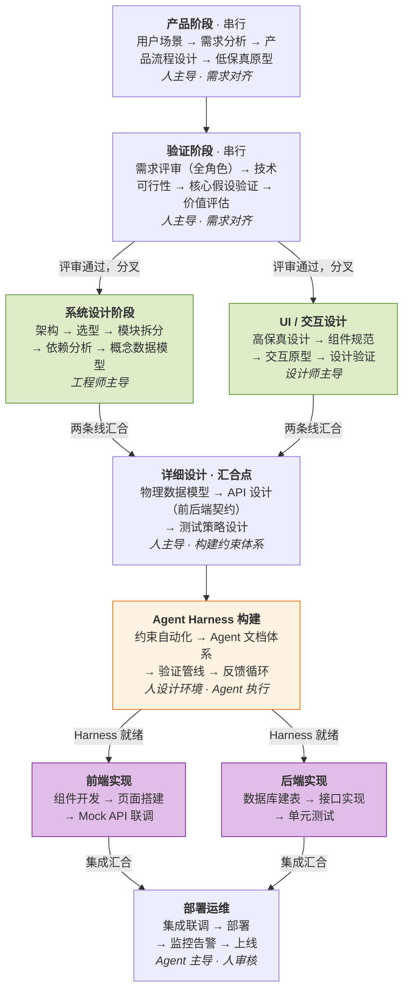
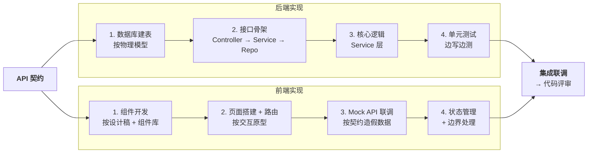

系统设计的本质是：**从模糊的需求到可运行的系统**。

# 从需求到上线——完整的系统设计方法论

> 系统设计不是"画架构图"。它是一个工程师建立**全局思维**的必经之路——从用户痛点出发，穿过产品流程、架构拆分、数据建模，一路到代码实现、测试验证、部署运维。每一层都不能跳过，每一层的决策都在影响下一层。

---

## 为什么需要完整的系统设计思维

大多数工程师的日常是：拿到需求 → 写代码 → 提测 → 上线。

这条路径跳过了最关键的东西：**理解**。

- 你知道代码怎么写，但你知道**为什么要写这段代码**吗？
- 你知道接口怎么定义，但你知道**为什么是这个接口而不是那个**吗？
- 你知道数据库怎么建表，但你知道**这张表在整个业务链路中扮演什么角色**吗？

完整的系统设计思维，本质上是在回答一个问题：

> **从一个模糊的用户痛点，到一个可运行的系统，中间到底发生了什么？**

掌握这个全链路，你就不再只是"写代码的人"，而是"能把事情从0做到1的人"。

---

## 全流程总览



注意：这个流程**不是纯线性的**。它有两个关键特征——**并行**和**迭代**。

**并行**：验证通过后，系统设计和 UI/交互设计可以同时推进；实现阶段前后端可以同时开发。详见下方并行关系说明。

**迭代**：每个阶段都可能回到上一阶段修正，后面"迭代思维"会详细讲。

### 各阶段角色参与矩阵

| 阶段               | 主导角色          | 深度参与        | 轻度参与 / 评审          |
| ---------------- | ------------- | ----------- | ------------------ |
| 产品阶段             | 产品经理          | 设计师         | 技术 Lead（可行性直觉）     |
| 低保真原型            | 设计师 + 产品      | —           | 前端工程师（布局可行性）       |
| 需求评审             | 产品经理          | **全角色到场**   | —                  |
| 技术可行性分析          | 技术 Lead       | 后端工程师       | 产品（回答业务疑问）         |
| 系统设计             | 技术 Lead / 架构师 | 后端工程师       | 产品（澄清需求）、设计师（交互约束） |
| UI / 交互设计        | 设计师           | 前端工程师       | 产品（验收）             |
| 详细设计             | 各模块负责人        | 测试工程师（测试策略） | 架构师（把关）            |
| Agent Harness 构建 | 架构师           | 全栈工程师       | —                  |
| 实现               | 工程师 / Agent   | —           | 架构师（Code Review）   |
| 部署运维             | SRE / DevOps  | 后端工程师       | 产品（验收上线）           |

**核心原则**：每个阶段让**对的人主导**，其他人"参与但不干扰"。需求评审是唯一需要全角色强制到场的节点。

### 阶段并行关系

流程中有两个**可并行的分叉点**和两个**必须汇合的收束点**：

| 分叉点 | 并行轨道 | 为什么能并行 | 在哪里汇合 |
|--------|---------|-------------|-----------|
| 验证通过后 | 系统设计 ∥ UI/交互设计 | 输入相同（PRD + 低保真），产出正交（架构 vs 视觉） | 详细设计：API 是前后端的契约 |
| Harness 构建完成后 | 前端实现 ∥ 后端实现 | 接口已约定，各自独立开发 | 集成联调 |

**不能并行的部分**：
- 产品阶段 → 验证阶段：必须串行，需求没对齐就设计是浪费
- 详细设计 → Harness 构建：Harness 依赖详细设计的产出
- 集成联调 → 部署：必须联调通过才能上线

> [!important] AI 时代的分水岭
> 整条链路的**认知顺序不变**——你仍然不能跳过需求直接画架构，不能跳过数据模型直接写 API。
> 变的是**执行者**：需求对齐阶段是人的工作，实现阶段可以通过构建环境外包给 Agent。
> 中间的系统设计阶段，则是这个转变的枢纽——你的设计既要服务业务，也要服务 Agent。
> 详见第五个核心思维：[[#五、Agent Harness：为 AI 构建执行环境]]。

---

## 第一阶段：产品阶段（技术无关）

> 这一阶段**完全不谈技术**。只关心一件事：用户的问题是什么？怎么解决？

### 1. 用户场景与痛点发现

从真实场景出发，不是从技术出发：

- **谁**在用？（用户画像）
- 在什么**场景**下用？（使用情境）
- 遇到了什么**问题**？（核心痛点）
- 现在怎么**凑合解决**的？（现有方案）

### 2. 需求分析

把模糊的"痛点"变成明确的"需求"：

| 维度 | 问题 | 示例 |
|------|------|------|
| 功能需求 | 系统**必须做什么**？ | 生成面试题、评估答案 |
| 非功能需求 | 系统**必须多好**？ | 响应<3秒、99.9%可用 |
| 约束条件 | 有什么**限制**？ | 预算、团队规模、合规 |
| 优先级 | 什么**先做**？ | P0核心流程 > P1辅助功能 |

### 3. 产品流程设计

这一步是**想象力**的发挥。

就算你是程序员，也必须跳出技术思维。不要想"这个能不能实现"，而是想"如果没有任何技术限制，最好的体验是什么"。

> 步子不能迈太大——但主要限制应该是**已有能力和业务现实**，而不是技术边界。技术的边界可以推，但业务不到位硬推就是空中楼阁。

**产出：PRD（Product Requirement Document）**

```yaml
PRD 内容清单:
  - 产品目标: 一句话说清楚要解决什么问题
  - 目标用户: 谁在用，用户画像
  - 核心场景: 3-5个关键使用场景
  - 功能列表: 按优先级排列
  - 用户流程: 完整的用户操作路径
  - 非功能需求: 性能、安全、可用性要求
  - 成功指标: 怎么衡量做得好不好
```

### 4. 低保真原型（Low-Fi Wireframe）

产品流程设计回答了"用户按什么顺序操作"（**剧本**），低保真原型回答的是"每一步在屏幕上长什么样"（**分镜头画板**）。

```
产品流程设计（剧本）              低保真原型（分镜）
─────────────────              ─────────────────
"用户输入 JD"            →     一个大文本框 + 上传按钮
"AI 解析并出题"          →     加载动画 → 对话气泡出现
"用户回答问题"           →     输入区 + 倒计时 + 提交键
"AI 判断对错并调整难度"   →     评分卡片 + 下一题过渡
```

**低保真原型的定位**：

| 维度 | 低保真原型 | 高保真原型 |
|------|-----------|-----------|
| **时机** | 产品流程确定后，评审之前 | 系统设计并行阶段，UI 设计师主导 |
| **关心什么** | 骨架——功能放哪、信息层级、操作路径 | 皮囊——颜色、字体、动效、品牌一致性 |
| **工具** | 纸笔、白板、Balsamiq、简单 Figma | Figma 完整设计、Sketch |
| **精度** | 灰色方块 + 文字标注，5 分钟画一页 | 像素级还原，可能需要数天 |
| **谁做** | 产品 + 设计师协作 | 设计师主导 |
| **用来干嘛** | 拿去需求评审——所有人对着"分镜"讨论，比纯文字高效 10 倍 | 给前端开发做视觉参考 |

**为什么低保真必须在评审之前完成？**

1. **对齐效率**：纯文字 PRD 说"用户输入 JD"，每个人脑子里想的界面都不一样。画出来，30 秒对齐
2. **暴露遗漏**：画的时候你会发现——"等等，用户输入完 JD 点了提交，如果解析失败怎么办？"——这些文字阶段想不到的细节会自动冒出来
3. **成本极低**：低保真的核心是"快"和"便宜"，画错了擦掉重画，没有沉没成本

**产出：Low-Fi Wireframe**——核心页面的线框图，标注页面间的跳转关系。

---

## 第二阶段：验证阶段（投入前确认方向）

> 在花三个月写代码之前，先花一周验证核心假设。

### 1. 需求评审

拉上所有角色（产品、设计、工程、测试），回答：

- 需求是否**清晰**？有没有歧义？
- 优先级是否**合理**？先做什么？
- 是否有**遗漏**的场景？

### 2. 技术可行性分析

工程师初步评估：

- 核心功能**技术上能不能做**？
- 有没有**技术风险**？（比如依赖的第三方API不稳定）
- **粗略工期**是多少？

### 3. 核心假设验证

需求评审和技术可行性解决的是"方向对不对"。这一步解决的是"关键假设成不成立"——用最小成本验证，而不是直接开干。

注意：低保真原型已经在产品阶段完成了（用于需求评审对齐）。这里的验证面向的是更深层的假设。

| 验证手段            | 验证什么       | 成本  | 谁来做   | 典型场景                         |
| --------------- | ---------- | --- | ----- | ---------------------------- |
| **MVP**（最小可用产品） | 业务逻辑能不能跑通  | 中   | 全栈工程师 | "AI 出题→用户答→AI 评分"这条链路真的能闭环吗？ |
| **POC**（技术验证）   | 关键技术方案是否可行 | 低   | 后端工程师 | "GPT-4 能不能在 3 秒内完成评分？"       |
| **高保真原型**       | 核心交互体验是否自然 | 中   | 设计师   | "面试过程中实时出分，用户会不会焦虑？"         |


**不是每个项目都需要全做**——判断标准是：哪个假设失败了，整个项目就得推翻？那个假设就是你要优先验证的。

### 4. 价值评估：值不值得做

> 技术可行性回答"**能不能做**"，价值评估回答"**值不值得做**"——这是验证阶段的**最终决策门**，通过了才进入系统设计阶段的大规模投入。

> [!warning] 价值评估是两次迭代，不是一次性完成的
> 此时没有技术方案，**运营成本（服务器、第三方 API 费用）无法精确计算**——那需要等技术选型完成之后。
> 这里做的是**量级估算**：够精确到判断"这是一个 1 周的小需求，还是 6 个月的大项目"，足够支撑"要不要进入系统设计"这个决策即可。
> 技术选型完成后（系统设计阶段 §2），必须回来刷新运营成本的精确数字。

**评估框架：成本 vs 价值**

| 侧 | 维度 | 数据来源 | 此阶段精度 |
|----|------|---------|-----------|
| **成本侧** | 开发成本 | 技术可行性给出的粗略工期 × 团队规模 | 较可靠 |
| | 运营成本 | 公开定价 + 同类项目经验（⚠️ 粗估） | **待技术选型后刷新** |
| | 机会成本 | 做这个就不做什么，排期冲突 | 较可靠 |
| | 维护成本 | 类似系统的经验估算 | 粗估 |
| **价值侧** | 商业价值 | 带来多少营收 / 留存 / 转化？ | 预估 |
| | 战略价值 | 有没有长远的卡位意义？ | 定性判断 |
| | 学习价值 | 团队能力和技术资产 | 定性判断 |

**决策输出**：

```yaml
价值评估结论（第一次，量级估算）:
  开发成本: ~X 人周（来自技术可行性）
  运营成本: 粗估 ~Y 元/月（⚠️ 待技术选型后精确化）
  预期收益: 指标 A 提升 ~Z%
  决策:
    - ✅ 全量做：量级上 ROI 明确，值得进入系统设计
    - ⚠️ MVP 减量：方向对，但先做最小版本验证
    - ❌ 不做：量级上成本 > 价值，或机会成本太高
  复盘节点: 上线 N 周后，回来对比预期 vs 实际
  待刷新: 技术选型完成后，更新运营成本精确数字
```

**四个常见决策陷阱**：

| 陷阱     | 表现                 | 对策                |
| ------ | ------------------ | ----------------- |
| 功能主义   | "这个功能很酷"，但没算用户会不会用 | 先问：谁会因为这个留下来？     |
| 沉没成本   | "都做了一半了，不做完可惜"     | 已投入成本不影响未来决策      |
| 乐观估算   | 开发周期总是低估 2-3 倍     | 给所有估算乘以 1.5-2 倍系数 |
| 忽略机会成本 | "这个不花什么钱"，但时间是稀缺的  | 明确做这个意味着不做什么      |
|        |                    |                   |

---

## 第三阶段：系统设计阶段（工程师深度参与）

> 产品说清了"做什么"，现在工程师要回答"怎么做"。
> 与此同时，设计师在**并行推进 UI/交互设计**——两条线独立工作，在详细设计阶段汇合。

### 1. 系统架构设计

架构必须服务于产品流程，不是反过来。

**典型分层架构**（以 AI 应用为例）：

```
Frontend（用户界面）
    ↓
API Gateway（请求路由、鉴权、限流）
    ↓
Application Service（业务逻辑编排）
    ↓
AI Service（模型调用、提示词管理）
    ↓
Evaluation Engine（评估引擎）
    ↓
Database（数据持久化）
```

**关键决策**：

| 决策点 | 选项 | 影响因素 |
|--------|------|---------|
| 单体 vs 微服务 | 早期单体，后期拆分 | 团队规模、业务复杂度 |
| 同步 vs 异步 | 耗时操作用异步 | 响应时间要求 |
| 自建 vs 外购 | 核心自建，通用外购 | 成本、可控性 |

**产出：System Design Doc**

```yaml
System Design Doc 内容:
  - 系统整体架构图
  - 核心模块及职责
  - 服务划分方式
  - 依赖的外部系统
  - 数据流转路径
  - 非功能需求 → 架构决策映射
```

### 2. 技术选型

每一个选型都应该有**理由**，不是"我熟悉所以用它"。

**选型决策模板**：

| 维度 | 选项A | 选项B | 选项C |
|------|-------|-------|-------|
| 功能匹配度 | ★★★ | ★★☆ | ★★★ |
| 团队熟悉度 | ★★★ | ★☆☆ | ★★☆ |
| 社区生态 | ★★★ | ★★★ | ★★☆ |
| 性能 | ★★☆ | ★★★ | ★★★ |
| 运维成本 | ★★★ | ★☆☆ | ★★☆ |
| **结论** | **选择** | 备选 | 排除 |

**产出：Tech Selection Doc**——记录选型过程和决策依据。

> [!important] 技术选型完成后，回头刷新 ROI
> 选型确定了具体的云厂商、AI API、数据库方案，运营成本才能从"粗估"变成"精确数字"。
> 此时需要回到验证阶段产出的 ROI 评估文档，将运营成本一栏更新为真实报价，确认决策结论仍然成立。

### 3. 核心模块拆分

目标：把一个产品需求拆成**可以独立开发、测试、扩展**的系统组件。

**拆分原则**：

- **单一职责**：一个模块只做一件事
- **高内聚低耦合**：模块内部紧密关联，模块之间松散连接
- **接口驱动**：模块之间通过接口通信，而不是直接依赖

**产出：Module Design Doc**

```yaml
Module Design Doc 内容:
  - 模块名称与职责
  - 模块输入/输出
  - 模块之间的调用关系
  - 核心算法或逻辑
  - 扩展点设计
```

### 4. 依赖系统分析

核心模块拆分解决的是**系统内部结构**。依赖系统分析解决的是**系统运行需要什么外部能力**。

```yaml
依赖系统分类:
  基础设施:
    - 数据库: MySQL / PostgreSQL / MongoDB
    - 缓存: Redis
    - 消息队列: Kafka / RabbitMQ
    - 文件存储: OSS / S3

  第三方服务:
    - AI 模型: OpenAI API / Claude API
    - 认证: OAuth2.0
    - 支付: 支付宝 / 微信支付
    - 短信: 阿里云SMS

  内部平台:
    - 配置中心
    - 日志平台
    - 监控系统
    - CI/CD 流水线
```

这些基础设施在设计系统时，应该作为**外部黑盒**考虑——你关心它能提供什么能力，不关心它内部怎么实现。

### 5. 概念数据模型设计

注意，这里做的是**概念层**的数据模型——实体和关系的抽象，**与具体数据库无关**。

```
实体识别
    ↓
关系建模（1:1 / 1:N / M:N）
    ↓
核心字段定义
    ↓
（后续在详细设计阶段细化为物理模型）
```

**产出：Data Model Design（概念层）**

### 并行轨道：UI / 交互设计（设计师主导）

在工程师做系统设计的同时，设计师从低保真原型出发，推进高保真设计。这两条线的输入相同（PRD + 低保真原型），但产出正交——一个解决"系统怎么撑"，另一个解决"用户怎么用"。

**UI/交互设计做什么**：

```
低保真原型（骨架）
    ↓
视觉风格定义（品牌色、字体、间距规范）
    ↓
核心页面高保真设计
    ↓
交互细节（动效、状态切换、异常态展示）
    ↓
组件库 / 设计系统
    ↓
可交互原型（Figma Prototype）→ 内部走查 + 用户测试
```

**产出**：

| 产出物 | 内容 | 给谁用 |
|-------|------|-------|
| **Design Spec**（设计规范） | 颜色、字体、间距、组件样式 | 前端工程师 |
| **交互原型** | 可点击的 Figma 原型 | 产品验收、用户测试 |
| **组件库文档** | 组件命名、使用规则、变体 | 前端工程师 + Agent |
| **页面标注稿** | 每个页面的尺寸、间距、状态标注 | 前端实现参考 |

**两条线的协作点**：

虽然并行，但不是完全隔离。以下几个时刻需要两条线**短暂同步**：

| 同步时刻 | 工程师需要告诉设计师 | 设计师需要告诉工程师 |
|---------|-------------------|-------------------|
| 数据模型初步确定后 | "这些字段是系统能提供的数据" | — |
| 交互原型完成时 | — | "这个交互需要这些数据和状态" |
| API 设计前（汇合点） | "技术上这样实现成本最低" | "用户体验上这个交互不能砍" |

---

## 第四阶段：详细设计阶段（两条线汇合，从抽象走向具体）

> 系统设计（工程师）和 UI/交互设计（设计师）两条并行线，在这个阶段汇合。
> 汇合点就是 **API 设计**——它既是前端要调用的接口，也是后端要实现的契约。

### 1. 物理数据模型设计

将概念数据模型转化为具体的数据库设计：

```
概念模型
    ↓
表结构设计（字段、类型、约束）
    ↓
索引设计（查询模式驱动）
    ↓
分库分表策略（数据量驱动）
```

### 2. API 设计（前后端契约）

这一步是系统设计和 UI 设计的**正式汇合点**。数据库确定了"系统能提供什么数据"，设计稿确定了"页面需要什么数据"——API 设计就是在两者之间建立契约。

**设计原则**：

- **RESTful 规范**：资源导向，HTTP 语义
- **统一响应格式**：一致的数据结构、错误码
- **版本控制**：`/api/v1/...`，向前兼容
- **幂等性**：重复请求不产生副作用

**产出：API Spec**

```yaml
API Spec 内容:
  - 接口路径: POST /api/v1/interviews
  - 请求参数: { job_id, difficulty, question_count }
  - 返回结构: { code, data, message }
  - 错误码: 40001 参数错误 / 50001 服务内部错误
  - 鉴权方式: Bearer Token
  - 限流策略: 100次/分钟
```

### 3. 测试策略设计

在实现**之前**，先明确怎么测试。

**测试金字塔**：

```
      E2E 测试（少量，覆盖核心流程）
     /                            \
   集成测试（适量，覆盖模块交互）
  /                                \
单元测试（大量，覆盖核心逻辑）
```

**产出：Test Strategy Doc**

| 测试层级 | 覆盖范围 | 数量 | 执行频率 |
|---------|---------|------|---------|
| 单元测试 | 核心算法、工具函数 | 多 | 每次提交 |
| 集成测试 | 模块间交互、数据流 | 中 | 每次PR |
| E2E测试 | 核心用户场景 | 少 | 每次部署 |
| 性能测试 | 关键接口性能指标 | 少 | 版本发布 |

---

## 第五阶段：实现阶段（代码落地）

> 先写设计文档，再写代码。这是好的工程实践。
> API 契约确定后，前端和后端可以**并行开发**，最终在集成联调阶段汇合。

### 实现顺序

前后端在 API 契约确定后可以并行推进：



**前端为什么不用等后端？** 因为 API 契约（路径、参数、返回结构）已经定了，前端可以用 Mock 数据先跑通所有页面和交互。后端接口上线后，把 Mock 切成真实请求即可。

### 关键技术方案

对于复杂的技术问题，需要单独的技术方案文档：

- **高并发方案**：缓存策略、限流降级
- **数据一致性**：事务方案、补偿机制
- **安全方案**：加密、鉴权、审计
- **AI集成方案**：模型选择、提示词工程、流式响应

---

## 第六阶段：部署运维阶段（让系统"活着"运行）

> 系统不只是要"能运行"，还要"稳定运行"。

### 1. 部署策略

| 策略 | 适用场景 | 风险 |
|------|---------|------|
| 蓝绿部署 | 要求零停机 | 需要双倍资源 |
| 金丝雀发布 | 渐进式验证 | 需要流量管理 |
| 灰度发布 | 按用户特征放量 | 需要配置中心 |

### 2. 监控告警

**可观测性三大支柱**：

| 支柱 | 记录什么 | 回答什么问题 |
|------|---------|-------------|
| Metrics（指标） | 数值化监控数据 | 系统现在好不好？ |
| Logs（日志） | 离散事件记录 | 刚才发生了什么？ |
| Traces（追踪） | 请求完整链路 | 这个请求慢在哪？ |

### 3. 应急预案

```yaml
故障响应流程:
  1. 发现: 监控告警触发
  2. 确认: 查看 dashboard 和日志
  3. 止损: 回滚/降级/重启
  4. 定位: 分析 trace 和日志
  5. 修复: 紧急 patch
  6. 复盘: 撰写 Postmortem 文档
```

---

## 各阶段文档产出汇总

| 阶段 | 文档 | 核心内容 | 主要负责人 |
|------|------|---------|-----------|
| 产品阶段 | **PRD** | 产品目标、用户、场景、功能列表、流程 | 产品经理 |
| 产品阶段 | **Low-Fi Wireframe** | 核心页面线框图、页面跳转关系 | 设计师 + 产品 |
| 验证阶段 | **ROI 评估文档** | 成本估算（人力 / 运营 / 机会）、价值预期、决策结论（做 / 减量 / 不做）、复盘节点 | 产品经理 + 技术 Lead |
| 系统设计阶段 | **System Design Doc** | 架构、模块、服务划分、依赖、数据流 | 架构师 |
| 系统设计阶段 | **Tech Selection Doc** | 选型对比、决策依据、风险评估 | 技术 Lead |
| 系统设计阶段 | **Module Design Doc** | 模块职责、输入输出、调用关系、核心算法 | 模块负责人 |
| UI/交互设计（并行） | **Design Spec + 交互原型** | 视觉规范、组件库、可交互原型、标注稿 | 设计师 |
| 详细设计（汇合） | **Data Model Design** | 实体关系、表结构、索引策略 | 后端工程师 |
| 详细设计（汇合） | **API Spec** | 接口路径、参数、响应、错误码（前后端契约） | 前后端协定 |
| 详细设计 | **Test Strategy** | 测试层级、覆盖范围、测试数据 | 测试工程师 |
| Agent Harness | **ARCHITECTURE.md / AGENTS.md / RULES.md** | 架构约束、行为指引、开发规则（Agent 可读版） | 架构师 |
| 部署阶段 | **Deploy & Ops Doc** | 部署策略、监控、告警、应急预案 | SRE / DevOps |
| 贯穿全程 | **ADR** | 每个关键决策的背景、选项、理由 | 决策参与者 |

---

## 五个核心思维

流程只是**术**，以下五个思维才是**道**。

### 一、迭代思维：设计不是一次性的

> 不要追求第一版就完美，追求每一版都在逼近正确。

系统设计是**螺旋式上升**的，不是瀑布式的直线：

```
Round 1（需求刚确定）
  → 粗略架构 + 核心模块列表
  → 评审暴露问题
    ↓
Round 2（评审后）
  → 修正架构 + 详细模块设计
  → 技术可行性验证（POC）
    ↓
Round 3（POC 后）
  → 架构优化 + 详细接口设计
  → 开始编码
    ↓
Round 4（实现中发现问题）
  → 调整设计 + 重构
```

**为什么必须迭代？**

1. **认知局限**：你在需求阶段的理解一定是不完整的。用户说"我要聊天功能"，做出来才发现用户要的是"协作沟通"
2. **信息不对称**：产品懂业务不懂技术，工程师懂技术不懂业务，设计师懂体验不考虑成本——每轮迭代让不同角色补充视角
3. **变化的世界**：需求会变、技术会变、团队会变。迭代让系统有适应变化的能力

**操作方法**：

- 在设计文档中标注：**确定性部分**（核心流程）、**探索性部分**（可选方案）、**待定部分**（需要验证）
- 每个阶段设置**检查点**：需求评审 → 架构评审 → 技术评审 → 代码评审
- 设计覆盖 80% 核心场景，20% 留作迭代

**两个常见陷阱**：

| 陷阱 | 表现 | 正确做法 |
|------|------|---------|
| 完美主义 | "设计不100%完善不动手" | 先跑通主流程，再优化边界 |
| 瀑布思维 | "一步都不能乱" | 快速验证核心假设，发现问题立即调整 |

---

### 二、非功能需求的显式处理：它们决定架构

> 功能需求决定"做什么"，非功能需求决定"怎么做"。同样的功能，不同的非功能要求，架构完全不同。

**五大非功能需求及其架构影响**：

#### 性能需求

| 场景 | 性能指标 | 架构影响 |
|------|---------|---------|
| 社交信息流 | 首屏<200ms，10万QPS | 缓存、CDN、读写分离 |
| 实时聊天 | 消息延迟<100ms | WebSocket、消息队列 |
| 数据分析 | 查询<5s，TB级数据 | 列式存储、预聚合 |

#### 可扩展性

| 扩展维度 | 当前 → 未来 | 架构影响 |
|---------|------------|---------|
| 用户量 | 1万 → 100万 | 水平扩展、负载均衡 |
| 数据量 | 10GB → 10TB | 分库分表、冷热分离 |
| 功能数 | 10个 → 100个 | 微服务化、插件架构 |

#### 可用性

| 等级 | 年停机时间 | 架构要求 |
|------|-----------|---------|
| 99% | 3.65天 | 单机部署 |
| 99.9% | 8.76小时 | 主备 + 自动故障转移 |
| 99.99% | 52.56分钟 | 多地域容灾 |

#### 安全性

传输加密（HTTPS）、存储加密（敏感字段）、访问控制（RBAC）、操作审计（日志）。

#### 可维护性

模块化设计（职责单一）、接口标准化（统一响应格式）、文档驱动（代码注释 + 架构图 + ADR）。

**显式处理方法**：

在系统设计阶段，建立**非功能需求 → 架构决策**的映射表：

| 非功能需求 | 具体指标 | 架构决策 | 验证方法 |
|-----------|---------|---------|---------|
| 实时评分延迟<3s | P95<3s | 流式处理 + 缓存 | 压力测试 |
| 高可用99.9% | 年停机<8.76h | 多副本 + 自动重启 | 混沌工程 |
| 数据合规 | 符合隐私法规 | 加密存储 + 审计日志 | 安全审计 |

---

### 三、测试和运维：系统设计包括"怎么运行"

> 系统不只是要"能跑起来"，更要"稳定地跑着"。

**测试策略要点**：

- **测试金字塔**：单元测试多、集成测试适中、E2E测试少。倒置的金字塔（E2E多，单元少）是灾难——慢、脆弱、难调试
- **测试数据管理**：标准数据（正常路径）、边界数据（空值、超长输入）、异常数据（服务超时、权限不足）
- **性能测试**：基准测试（单接口基线）→ 负载测试（找拐点）→ 压力测试（极限）→ 耐久测试（内存泄露）

**运维设计要点**：

- **可观测性三支柱**：Metrics（系统好不好）、Logs（发生了什么）、Traces（慢在哪）
- **告警分级**：P0 立即处理（服务不可用）→ P1 一小时内（核心功能异常）→ P2 当天处理（非核心异常）
- **降级策略**：核心功能不降级 → 次要功能可降级（展示部分数据）→ 辅助功能可关闭（数据报告）
- **故障流程**：发现 → 确认 → 止损 → 定位 → 修复 → **复盘**（Postmortem）

---

### 四、决策记录：记录"为什么"比记录"是什么"更重要

> 6个月后，你（或新人）需要知道"为什么这么设计"，而不是"设计了什么"——代码本身就是"是什么"的记录。

**ADR（Architecture Decision Record）**是一种轻量级文档，记录每一个重要的架构决策：

```markdown
# ADR-001: 选择 WebSocket 而非轮询实现实时评分

## 状态
已采纳

## 背景
面试辅助系统需要实时评分功能，用户答题后立即看到反馈。

## 驱动因素
- 性能要求：延迟<300ms
- 服务器资源：1000并发下，轮询产生大量无效请求
- 用户体验：实时响应，无感知刷新

## 考虑的选项
| 方案 | 优点 | 缺点 | 结论 |
|------|------|------|------|
| 客户端轮询 | 实现简单 | 延迟高，资源浪费 | 不满足性能要求 |
| 长轮询 | 实时性较好 | 连接管理复杂 | 备选 |
| WebSocket | 真正双向，低延迟 | 需处理连接断开 | ✅ 选择 |

## 后果
- 正面：实时性<100ms，服务器负载降低60%
- 负面：需要额外开发连接管理逻辑
- 风险缓解：WebSocket 失败时降级为轮询
```

**为什么需要 ADR？**

| 场景 | 没有ADR | 有ADR |
|------|--------|-------|
| 新人问"为什么用WebSocket" | 翻代码找不到解释，找老员工回忆 | 5分钟读完决策过程 |
| 技术债要不要还 | 不知道当初为什么这么设计 | 清楚看到驱动因素是否还成立 |
| 同样的坑再踩一次 | "这个问题我们之前讨论过吗？" | 历史决策可追溯 |

**什么时候写 ADR？**

- ✅ 技术选型、架构变更、重要设计、性能优化
- ❌ 局部实现细节、临时方案、显而易见的选择

**ADR 的生命周期**：

```
提议 → 讨论 → 采纳 → 可能被替代 → 可能被废弃
```

状态更新时链接到新 ADR，形成决策链：
```
ADR-003: 使用 MongoDB（2025-06，已替代）
  → ADR-015: 迁移到 PostgreSQL（2025-12，已采纳）
  原因：业务稳定后，关系型数据库性能更优
```

---

### 五、Agent Harness：为 AI 构建执行环境

> 过去，架构设计是为了指导"人怎么写代码"。现在，架构设计是为了指导"Agent 怎么写代码"。
> 需求对齐是人的工作。实现，可以通过构建环境外包给 AI。

这是 AI 时代系统设计最本质的变化。不是链路变了，而是链路中**每个环节的执行方式和权重**变了。

> [!info] 深入阅读
> 本节核心概念来自 [[4 - 为 AI Agent 构建开发环境、约束和反馈系统]]（Harness Engineering）。那篇文章详细拆解了 OpenAI 团队用 3 个工程师 + Agent 在 5 个月内从空仓库构建百万行代码产品的完整实践。

#### 什么是 Harness

Harness = 马具、安全带。Harness Engineering = **为 AI Agent 构建开发环境、约束和反馈系统**。

一句话：

```
Humans steer.  Agents execute.
人类把方向。  Agent 做实现。
```

#### 范式转变：从"写代码"到"设计环境"

传统工程师的一天：

```
读需求 → 写代码 → 调试 → 提交 → Code Review
```

Agent 时代工程师的一天：

```
设计系统结构 → 拆解任务 → 提供上下文 → 构建自动验证 → 审核产出
```

> [!quote] 编程 Agent 重塑 EPD 角色
> 正如 [[Clippings/编程 Agent 如何重塑工程、产品和设计]] 所指出的，编程 Agent 让写代码变得异常简单，这导致了三个核心变化：
> - **PRD 已死**：传统"PRD → 设计稿 → 代码"的流程终结了
> - **瓶颈从实现转向评审**：现在谁都能写代码，EPD 的角色变成评审者和把关人
> - **通才比以往更有价值**：一个人如果能在产品、设计、工程三方面都有不错的感觉，影响力会指数级提升
>
> 这与我们讨论的"从写代码到设计环境"的范式转变高度一致——核心变化不是工具，而是**角色的根本转变**。

这两条路径的区别，不是工具的区别，而是**角色的根本转变**：

| 传统能力 | Agent 时代对应能力 |
|---------|------------------|
| 写算法 | 设计架构约束 |
| 写测试 | 设计自动验证管线 |
| Code Review | 构建 lint / CI 自动化规则 |
| 读文档 | **写文档给 Agent 读** |
| 调试 bug | 让 Agent 能自己 debug（给它可观测能力）|

最后一条最反直觉——过去文档是写给人看的，现在文档是**同时写给 Agent 看的**。

#### 为什么前四个阶段的设计质量，直接决定 Agent 的产出质量

回看我们的全流程：

```
产品阶段 → 验证 → 系统设计 → 详细设计 → [Agent Harness] → 实现 → 运维
```

前四个阶段产出的设计文档——PRD、架构图、模块设计、数据模型、API Spec、测试策略——在传统模式下是给人看的参考资料。

在 Agent 模式下，它们是 Agent 的**执行依据**。

Agent 只能看到 repo 里的东西：

| ✅ Agent 能看到 | ❌ Agent 看不到 |
|----------------|----------------|
| 代码和注释 | Slack 消息 |
| README / AGENTS.md | Notion 文档 |
| Schema 定义 | 人脑中的知识 |
| 测试用例 | 口头约定 |
| lint 规则 | "大家都知道"的潜规则 |

**所以**：

> 每一条口头约定，如果没有变成 repo 里的文件，Agent 就不知道。
> 每一个"大家都知道"的惯例，如果没有写成规则，Agent 就会违反。

你的系统设计做得越清晰、越结构化、越可机读，Agent 的产出质量就越高。

#### Agent Harness 的四个构建维度

##### ① 架构约束自动化

把系统设计阶段的架构规则，变成**自动执行的约束**：

```
设计文档里写的：                 Harness 里的实现：
"UI 层不能直接访问数据层"    →   lint 规则自动检查依赖方向
"接口必须统一响应格式"       →   中间件自动包装 + 测试断言
"新模块必须有测试覆盖"       →   CI 管线检查覆盖率阈值
```

关键思路：**不靠人记住规则，靠自动化 enforce 规则。** Agent 违反规则时 CI 直接报错，Agent 读到报错后自己修。

##### ② Agent 文档体系

把设计决策转化为 Agent 可理解的文档：

```
repo/
├── ARCHITECTURE.md    ← 系统架构（来自 System Design Doc）
├── SCHEMA.md          ← 数据模型（来自 Data Model Design）
├── AGENTS.md          ← Agent 行为指引（来自 Module Design Doc）
├── RULES.md           ← 开发规则约束（来自架构决策）
├── API_SPEC.md        ← 接口规范（来自 API Spec）
└── tests/             ← 自动化测试（来自 Test Strategy）
```

注意这个对应关系——**Harness 文档体系不是凭空创造的，它是前几个阶段设计文档的 Agent 可读版本。**

这就是为什么前面的设计阶段如此重要：你的设计文档质量直接决定 Agent 文档体系的质量，进而决定 Agent 产出的质量。

##### ③ 自动验证管线

Agent 写完代码后，必须有一套自动化机制告诉它"对不对"：

```
Agent 写代码
    ↓
自动跑单元测试 → 通过？
    ↓ 不通过
Agent 读取报错 → 分析原因 → 重写 → 再测
    ↓ 通过
自动跑 lint 检查 → 通过？
    ↓ 不通过
Agent 读取规则违反 → 自动修复
    ↓ 通过
自动跑集成测试 → 通过？
    ↓ 通过
创建 PR → 等待人类审核
```

这个闭环是 Agent 区别于传统自动化脚本的关键——它能**自我纠错**。但前提是：你得把"什么是对的"定义清楚（测试用例 + 规则）。

##### ④ 反馈循环

当 Agent 犯错时，人类不修代码，而是**改环境**：

```
Agent 写出了坏代码
    ↓
传统做法：人类改代码 ← 治标不治本，下次还会错
Agent 做法：人类改环境 ← 让 Agent 下次自己写对
    │
    ├── 改文档：补充说明，让 Agent 理解意图
    ├── 改规则：添加约束，让 Agent 知道边界
    ├── 改测试：增加测试用例，让 Agent 能验证
    └── 改工具：给 Agent 更好的能力
```

这形成了一个**持续优化**的循环：Agent 犯错 → 人类改环境 → Agent 下次做对 → 环境越来越完善 → Agent 产出质量越来越高。

#### 代码熵：Agent 时代的新问题

Agent 会**复制已有模式**。如果 repo 里有坏代码：

```
坏 pattern → 被 Agent 学习 → 复制到新代码 → 扩散到整个 repo
```

这就是**代码熵**——Agent 不会判断"这段代码是不是过时的"，它只会模仿。

解决方案是建立**持续清理机制**：

1. 定义 **golden rules**——什么是好代码的标准
2. Agent **定期扫描** repo——找出违反规则的代码
3. 自动创建 **refactor PR**——持续修复

本质上是代码层面的**垃圾回收（GC）**——技术债持续清理，而不是积累到爆炸。

#### 这意味着什么

回到我们的系统设计流程。AI 时代的变化可以总结为一张表：

| 阶段 | 传统模式 | Agent 模式 | 核心变化 |
|------|---------|-----------|---------|
| 产品阶段 | 人主导 | 人主导 | 不变。需求理解是人的核心能力 |
| 验证阶段 | 人主导 | 人主导，AI 辅助原型 | 原型/MVP 生成速度大幅提升 |
| 系统设计 | 人主导 | 人主导 | **权重大幅提升**。设计质量直接决定 Agent 产出质量 |
| 详细设计 | 人主导 | 人主导 | 设计文档需同时考虑 Agent 可读性 |
| Harness 构建 | ——（不存在）| **新增阶段** | 把设计转化为 Agent 可执行的约束 |
| 实现 | 人写代码 | **Agent 写代码** | 人从执行者变为审核者 |
| 运维 | 人监控 | 人 + Agent 共同监控 | Agent 可自己查日志、自己 debug |

**本质变化**：

```
传统：人设计 → 人实现
AI时代：人设计 → 人构建环境 → Agent 实现 → 人审核
```

前半段（设计）的重要性不是降低了，而是**急剧提升了**。因为过去设计得模糊，人可以在编码时"脑补"；现在设计得模糊，Agent 就会写出错误的代码。

> **你的设计文档有多清晰，Agent 的产出就有多靠谱。**

---

## 实战案例：面试辅助系统

> 用一个完整案例，把以上所有流程串起来。

### 产品阶段

**用户痛点**：面试准备无从下手，缺乏系统性和针对性。

**需求拆解**（按面试全生命周期）：

| 阶段 | 用户需求 | 核心功能 |
|------|---------|---------|
| 面试前 | 不知道准备什么 | 岗位分析 → 能力差距评估 → 学习路径推荐 |
| 面试中 | 不知道怎么答 | 模拟面试 → 实时反馈 → 答案结构建议 |
| 面试后 | 不知道哪里不好 | 复盘分析 → 薄弱点诊断 → 改进计划 |

### 产品流程设计

**核心用户流程**（产品视角）：

```
用户注册/登录
    ↓
填写目标岗位 + 个人简历
    ↓
系统生成能力评估报告（你的现状 vs 岗位要求）
    ↓
推荐学习路径 + 练习计划
    ↓
开始模拟面试（AI 面试官）
    ↓
面试过程实时评分 + 提示
    ↓
面试结束 → 生成详细复盘报告
    ↓
持续练习 → 跟踪进步曲线
```

**系统角度流程**（技术视角）：

```
Job 数据爬取/录入
    ↓
岗位 JD 解析 → 技能图谱构建
    ↓
用户简历解析 → 用户能力画像
    ↓
能力差距分析（图谱匹配）
    ↓
面试题生成（基于差距 + 岗位权重）
    ↓
面试会话管理（多轮对话）
    ↓
实时答案评估（关键词 + 语义理解）
    ↓
报告生成 + 数据归档
```

这两条流程的对应关系，直接决定了系统模块的划分。

### 系统架构设计

```
┌─────────────────────────────────────────────┐
│                 Frontend                     │
│          (React / Next.js)                   │
└──────────────────┬──────────────────────────┘
                   │
┌──────────────────▼──────────────────────────┐
│              API Gateway                     │
│        (Nginx / Kong)                        │
│     鉴权 · 限流 · 路由 · 日志                │
└──────────────────┬──────────────────────────┘
                   │
┌──────────────────▼──────────────────────────┐
│          Application Service                 │
│     业务逻辑编排 · 流程控制                   │
├─────────┬─────────┬─────────┬───────────────┤
│ Job管理 │技能图谱  │面试生成  │ 用户管理      │
│ Service │Service  │Service  │ Service       │
└────┬────┴────┬────┴────┬────┴───────────────┘
     │         │         │
┌────▼─────────▼─────────▼────────────────────┐
│              AI Service                      │
│     模型调用 · 提示词管理 · 流式响应          │
└──────────────────┬──────────────────────────┘
                   │
┌──────────────────▼──────────────────────────┐
│          Evaluation Engine                   │
│     答案评估 · 评分算法 · 反馈生成            │
└──────────────────┬──────────────────────────┘
                   │
┌──────────────────▼──────────────────────────┐
│              Database                        │
│    PostgreSQL(业务) · Redis(缓存/会话)        │
│    Elasticsearch(搜索) · OSS(文件)           │
└─────────────────────────────────────────────┘
```

### 核心模块拆分

| 模块 | 职责 | 输入 | 输出 |
|------|------|------|------|
| Job 管理模块 | 岗位信息的采集、解析、存储 | JD 原文 / URL | 结构化岗位数据 |
| Skill Graph 模块 | 技能图谱构建与匹配 | 岗位数据 + 用户简历 | 能力差距报告 |
| 面试生成模块 | 根据差距和岗位生成面试题 | 差距报告 + 题库配置 | 面试题集 |
| 面试会话模块 | 管理面试对话流程 | 用户输入 + 面试题 | 对话记录 |
| 评估引擎模块 | 答案评分与反馈 | 用户答案 + 评分标准 | 评分 + 反馈 |
| 报告生成模块 | 复盘报告和进步追踪 | 面试记录 + 历史数据 | 分析报告 |
| 用户管理模块 | 注册登录、画像管理 | 用户信息 | 用户画像 |

### 依赖系统分析

```yaml
基础设施:
  - PostgreSQL: 业务数据持久化
  - Redis: 面试会话缓存、排行榜
  - Elasticsearch: 岗位搜索、题目检索
  - OSS: 简历文件存储

第三方服务:
  - OpenAI / Claude API: 面试题生成、答案评估
  - 招聘平台 API: 岗位数据采集
  - OAuth2.0: 第三方登录

内部平台:
  - Prometheus + Grafana: 监控
  - ELK Stack: 日志
  - Jenkins / GitHub Actions: CI/CD
```

### 概念数据模型

```
User ──1:N──> Interview Session
User ──1:1──> User Profile（能力画像）
Job ──1:N──> Skill Requirement
Job ──1:N──> Interview Session
Interview Session ──1:N──> Question Record
Question Record ──1:1──> Evaluation Result
Skill ──M:N──> Job（技能图谱）
Skill ──M:N──> User（用户技能）
```

### API 设计示例

```
# 岗位管理
POST   /api/v1/jobs              创建岗位
GET    /api/v1/jobs/:id          获取岗位详情
GET    /api/v1/jobs/:id/skills   获取岗位技能要求

# 能力评估
POST   /api/v1/assessments       创建能力评估
GET    /api/v1/assessments/:id   获取评估结果

# 面试管理
POST   /api/v1/interviews        创建面试会话
POST   /api/v1/interviews/:id/answer   提交答案
GET    /api/v1/interviews/:id/report   获取面试报告

# 用户管理
GET    /api/v1/users/me/profile        获取用户画像
GET    /api/v1/users/me/progress       获取进步曲线
```

---

## 结语：从执行者到设计者

大多数工程师的成长路径：

```
初级：拿到需求写代码（执行者）
      ↓
中级：能独立完成模块设计（设计者）
      ↓
高级：能设计完整系统（架构者）
      ↓
专家：能判断什么该做、什么不该做（决策者）
```

AI 时代，这条路径加速了，但本质没变。变的是：**你不再需要亲自写每一行代码，但你更需要理解每一行代码为什么存在。**

每一级跃迁的核心，不是技术更强了，而是**视野更宽了**：

| 级别 | 传统关注点 | AI 时代关注点 | 核心能力 |
|------|-----------|-------------|---------|
| 初级 | 一个函数 | 一个 prompt | 编码 / 表达能力 |
| 中级 | 一个模块 | 一个模块的约束体系 | 设计能力 |
| 高级 | 一个系统 | 一个系统的 Harness | 架构能力 |
| 专家 | 一个业务 | 一个业务的 Agent 协作体系 | 判断力 |

系统设计方法论，就是帮你从"执行者"走向"设计者"的桥梁。

在 AI 时代，这座桥梁的重要性不是降低了，而是**急剧提升了**。因为：

- 过去，设计得模糊，人可以在编码时"脑补"
- 现在，设计得模糊，Agent 就会写出错误的代码

**你的全局思维越清晰，你能调动的 AI 执行力就越强大。**

> 全局思维不是"什么都管"，而是"什么都知道为什么"。
> 在 Agent 时代，这句话可以补一句：**然后把这些"为什么"写成 Agent 能读懂的规则。**

---

## 关联阅读

- [[0 - AI时代工程师方法论——系列总览]] — 本文是系列第 5 篇（完整方法论），查看系列全貌
- [[6 - 从 0 启动 AI 协作项目——实践手册]] — 系列篇 6：本文方法论的实践落地手册，每个阶段的具体操作步骤
- [[4 - 为 AI Agent 构建开发环境、约束和反馈系统]] — 系列篇 4：Harness Engineering 的完整拆解，包括 Agent Runtime 架构、可观测性设计、代码熵治理
- [[3 - 产品设计的最高效率——每个功能只写一次]] — 系列篇 3：平台思维与引擎化设计，系统设计中"抽象共性、差异外挂"的具体方法论
- [[1 - AI时代的常量与变量]] — 系列篇 1：AI 能力是常量，你对业务的理解是变量，系统设计能力属于后者
- [[2 - 囤积你懂得做的事]] — 系列篇 2：知识沉淀的方法论，Harness 的本质就是把隐性知识变成显性规则
