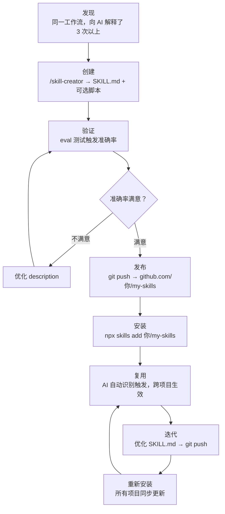

# 让经验可以被安装——自建 Skill 与个人工具管理

> Skill 不是提示词的快捷方式。它是经验的**可执行沉淀**。
> 当你把一段重复的工作流封装成 skill，你做的不是"保存提示词"，而是把一个认知习惯变成了一个可以安装、可以更新、可以分发的东西。

---



---

## 先明确一件事：Skill 不是提示词

| | 提示词（Prompt） | Skill |
|--|--|--|
| 形式 | 文字 | 文件（`SKILL.md` + 可选脚本） |
| 触发 | 手动粘贴 | AI 识别意图自动触发 |
| 管理 | 文档 / 笔记 | git 仓库 |
| 分发 | 复制粘贴 | `npx skills add` |
| 更新 | 手动同步 | git push → 重新安装拉取新版 |
| 跨项目 | 要手动带走 | 安装到任意项目 |

这不是同一类东西。提示词是**草稿**，skill 是**发布版本**。

---

## 什么时候值得封装成 Skill

不是所有经验都值得封装。判断标准只有一条：

> **你是否在不同上下文中，向 AI 解释过同一件事超过 3 次？**

具体信号：
- 每次新建项目都要重新解释某个工作流的规则
- 某段指令在多个项目的 `CLAUDE.md` 里几乎一模一样
- 一个检查 / 验证步骤总是需要人手动触发，而不是自动识别
- 你发现自己对 AI 的指令越写越长，实际上在反复补充同一个领域的背景知识

如果符合以上任何一条，这段经验已经"成熟"——值得封装。

**一个典型例子**：[[6 - 从 0 启动 AI 协作项目——实践手册]] 里的 harness 三件套（`/harness` `/harness-next` `/harness-check`）。这不是某个项目的专用工具，而是"如何在 AI 协作项目中保持流程纪律"这一**通用认知**的可执行版本。

---

## Skill 的文件结构

最小结构只需要一个文件：

```
.claude/skills/
└── my-skill/
    └── SKILL.md        ← 核心：描述 + 触发条件 + 执行逻辑
```

复杂 skill 可以附带脚本：

```
.claude/skills/
└── my-skill/
    ├── SKILL.md
    └── scripts/
        └── run.sh      ← Bash 脚本，在 SKILL.md 中通过 Bash tool 调用
```

`SKILL.md` 的关键要素：

```markdown
---
name: my-skill
description: |
  一句话描述这个 skill 做什么。
  触发词：用户说"..."、"..."时自动触发。
---

# My Skill

## 触发条件
...

## 执行步骤
...

## 输出格式
...
```

> ⚠️ `description` 字段是 AI 用来判断"要不要触发这个 skill"的唯一依据。写得越精准，触发越准确。这个字段决定了 skill 的"感知半径"。

---

## 用 `/skill-creator` 创建

不需要手动写 SKILL.md。`/skill-creator` 是专门用来**构建和优化 skill 的元工具**：

```
你：帮我创建一个 skill，在每次代码审查时自动检查 ARCHITECTURE.md 的违规项
→  /skill-creator 触发
→  引导你描述触发条件、执行逻辑、输出格式
→  生成 .claude/skills/arch-check/SKILL.md
→  运行 eval 测试触发准确率
→  迭代优化 description 直到准确率满意
```

**核心工作流**：

1. 描述你想封装的工作流
2. `/skill-creator` 生成初版 `SKILL.md`
3. 运行 eval 测试（会告诉你在哪些测试用例上触发失败）
4. 根据 eval 结果调整 `description` 字段
5. 重复直到准确率满意

---

## 用 GitHub 管理个人 Skills 仓库

这是让 skill 真正**跨项目可复用**的关键。

### 推荐仓库结构

```
my-skills/                         ← github.com/你/my-skills
├── README.md
└── skills/
    ├── harness/
    │   └── SKILL.md
    ├── harness-next/
    │   ├── SKILL.md
    │   └── templates/             ← 附带的模板文件
    ├── harness-check/
    │   ├── SKILL.md
    │   └── scripts/
    │       └── check.sh
    └── arch-review/
        └── SKILL.md
```

每个 skill 是仓库里的一个子目录。多个 skill 共存于同一个 repo，统一版本管理。

### 安装方式

`npx skills add` 支持多种来源，灵活选择：

```bash
# GitHub shorthand（最常用——安装整个 repo 的所有 skills）
npx skills add 你/my-skills

# 完整 GitHub URL 写法
npx skills add https://github.com/你/my-skills

# 只安装 repo 里的某一个 skill
npx skills add https://github.com/你/my-skills/tree/main/skills/harness

# SSH 方式（私有仓库）
npx skills add git@github.com:你/my-skills.git

# GitLab
npx skills add https://gitlab.com/你/my-skills

# 本地开发中测试（还没推到 github）
npx skills add ./my-skills
```

安装后 skill 文件写入当前项目的 `.claude/skills/` 目录。

### 更新机制——这是用 github 管理的核心价值

你的经验沉淀可以持续迭代。已安装到各个项目的 skill，随时可以拉取 github 上的最新版本。

```
你优化了 harness skill 的触发描述（提升准确率）
    ↓
git commit + git push → github
    ↓
在任意项目里重新运行 npx skills add
    ↓
该项目的 .claude/skills/harness/ 更新为新版本
```

**这个机制的意义**：你不是在"修改一个提示词"，而是在**发布一个更好的版本**。每次迭代都真实地落到了使用这个 skill 的每一个项目里。

---

## 两类 Skill：通用 vs 项目专属

并非所有 skill 都应该放到 github 仓库。

|  | 通用 Skill | 项目专属 Skill |
|--|--|--|
| **内容** | 工作方法论、通用检查逻辑 | 这个项目特有的规则 |
| **管理** | 个人 github repo（`my-skills`） | 项目内 `.claude/skills/` |
| **安装** | `npx skills add 你/my-skills` | 随项目 git 仓库存在 |
| **示例** | `/harness`、`/arch-review` | `/check-payment-flow`（只对这个项目有意义） |

**判断方法**：把这个 skill 放到你的下一个完全不同的项目里，还有用吗？
有用 → github 管理。没用 → 放在项目本地。

---

## 这是"囤积你懂得做的事"的最高形态

回到 [[2 - 囤积你懂得做的事]] 的核心论点：把你掌握的方法论系统性地积累，是 AI 时代最有价值的投资。

Skill 是这种积累的**可执行版本**：

- **文档**：描述你知道什么 → 需要阅读才能发挥价值
- **Skill**：编码你知道什么 → AI 直接调用，不需要你每次解释

当你的个人 skills 仓库里积累了 10 个、20 个 skill，发生的不只是"工具变多了"。
发生的是：你过去所有的方法论沉淀，变成了一个**可以安装到任意项目的认知系统**。

每次 `npx skills add 你/my-skills`，装进去的不是文件，是你。

---

## 关联阅读

- [[2 - 囤积你懂得做的事]] — 这篇文章的哲学基础
- [[6 - 从 0 启动 AI 协作项目——实践手册]] — harness skills 的具体使用场景
- [[4 - 为 AI Agent 构建开发环境、约束和反馈系统]] — skill 在 Agent Harness 体系中的位置
