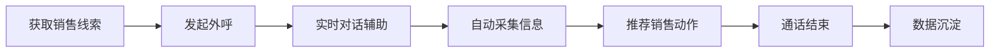

# 火山引擎 - AI 外呼销售场景会议案例

![[Pasted image 20260311113543.png]]
![[Pasted image 20260311113548.png]]

> **使用产品**：[客服 Agent](https://www.volcengine.com/docs/85800/1731185?lang=zh) | [智能外呼](https://www.volcengine.com/docs/6784/164616?lang=zh)

---

## 📋 目录

- [产品概述](#产品概述)
- [核心问题分析](#核心问题分析)
- [目标用户](#目标用户)
- [用户使用流程](#用户使用流程)
- [核心价值](#核心价值)
- [界面设计分析](#界面设计分析)
- [AI Agent 架构视角](#ai-agent-架构视角)

---

## 产品概述

这是一个 **AI 驱动的外呼销售工作台**，将呼叫中心、CRM、销售流程管理、AI 辅助能力整合在同一系统中。

**核心目标**：解决传统电话销售效率低、信息沉淀差、销售能力不稳定的问题。

**核心能力矩阵**：

| 能力维度 | 传统方案 | AI 方案 |
|---------|---------|---------|
| 销售话术 | 依赖个人经验 | SOP + AI 推荐 |
| 客户记录 | 手动填写 CRM | 对话自动抽取 |
| 产品知识 | 需要记忆 | 知识库 + AI 检索 |
| 质量监控 | 抽检录音 | 实时通话分析 |
| 数据沉淀 | 录音非结构化 | AI 结构化提取 |

---

## 核心问题分析

### 问题一：销售能力高度依赖个人

**痛点表现**：
- 新人不知道如何开场、推进成交、处理异议
- 不同销售话术差异大，成交率波动大

**解决方案**：销售SOP + AI推荐话术

```
开场 → 身份确认 → 需求确认 → 产品介绍 → 异议处理 → 促成试驾
```

AI 根据对话上下文实时推荐下一步话术，降低新人学习成本。

---

### 问题二：客户信息记录不完整

**痛点表现**：
- 销售打完电话再回 CRM 填写，很多人不填或漏填
- 客户说预算 20 万，CRM 里可能没记录

**解决方案**：对话信息自动抽取

```
语音识别 → 对话理解 → 信息抽取 → 自动填 CRM
```

**自动识别字段**：预算、购车周期、关注点、车型偏好

---

### 问题三：产品信息记忆成本高

**痛点表现**：
- 需要记住不同车型参数、优惠政策、对比差异
- 新人回答不准确

**解决方案**：知识库 + AI 推荐

> **客户问**："07 和 08 有什么区别？"
> **系统**：自动检索车型信息并生成回答建议，销售确认后发送

---

### 问题四：通话质量难以监控

**痛点表现**：
- 管理者难以了解销售是否按流程沟通
- 是否存在违规话术、客户情绪变化

**解决方案**：实时通话分析

**监控维度**：客户情绪、销售语速、通话节奏、关键话术触发

---

### 问题五：销售数据难以沉淀

**痛点表现**：
- 数据结构化程度低，关键信息只存在于录音中
- 客户真实需求、关注点、拒绝原因难以分析

**解决方案**：AI 结构化分析

**沉淀数据**：客户需求标签、购车阶段、兴趣车型、成交概率

---

## 目标用户

| 用户角色 | 核心需求 | 系统支持 |
|---------|---------|---------|
| **电话销售人员** | 提高沟通效率、减少查询时间、获得话术建议 | AI 实时辅助、话术推荐、知识库 |
| **销售管理者** | 标准化流程、提高成交率、监控质量 | 流程控制、数据分析、质量监控 |
| **企业运营团队** | 沉淀客户数据、分析线索质量、优化策略 | 结构化数据、AI 抽取信息 |

---

## 用户使用流程



### 1️⃣ 获取销售线索
**来源**：官网留资、活动报名、试驾预约、历史客户
**生成**：客户姓名、联系方式、兴趣车型、历史沟通记录

### 2️⃣ 发起电话外呼
销售点击外呼 → 系统连接呼叫中心 → 显示客户信息/通话时长/实时转写

### 3️⃣ 实时对话辅助
- **实时语音转写**：客户说话转换为文本
- **AI 推荐话术**：根据上下文推荐回复
- **销售流程提示**：显示当前阶段（开场/需求确认/产品介绍）

### 4️⃣ 自动采集客户信息
自动识别：预算、购车时间、购车用途、关注点 → 自动填入表单

### 5️⃣ 推荐销售动作
根据客户情况建议：推荐试驾、推荐车型、预约到店、结束通话

### 6️⃣ 通话结束
系统自动生成：客户需求、兴趣车型、下一步行动

### 7️⃣ 数据沉淀
**进入企业系统**：客户画像更新、销售数据统计、AI 模型训练数据
**支持分析**：哪些话术效果好、哪些客户易成交

---

## 核心价值

| 价值维度 | 具体体现 |
|---------|---------|
| **提升销售效率** | 减少信息查询、话术思考、CRM 填写时间 |
| **提高成交率** | 标准化流程 + 智能话术推荐 + 产品知识支持 |
| **数据结构化** | 通话信息自动整理成结构化数据，支持分析 |
| **知识沉淀** | 优秀销售经验沉淀为话术库、知识库、销售策略 |

---

## 界面设计分析

### 布局架构

```
┌─────────────────────────────────────────────────────────────┐
│                        通话控制区（顶部）                      │
├──────────┬──────────────────────────────┬───────────────────┤
│          │        客户信息区（左上）      │                   │
│          ├──────────────────────────────┤                   │
│          │                              │    AI 辅助区     │
│ 销售流程  │      客户信息录入区（中间）    │   （右侧）        │
│ 导航区    │                              │                   │
│（左侧）   ├──────────────────────────────┤  • 情绪分析      │
│          │                              │  • AI 推荐      │
│          │      实时对话区              │                   │
│          │    （聊天气泡形式）           │                   │
└──────────┴──────────────────────────────┴───────────────────┘
```

### 功能板块详解

| 板块 | 位置 | 核心功能 | 设计评价 |
|-----|------|---------|---------|
| **通话控制区** | 顶部 | CTI 集成、外呼状态、通话时长、控制按钮 | 电话是核心入口，设计合理 |
| **客户信息区** | 左上 | CRM 快速视图，显示客户背景 | 通话前快速了解，典型的 Quick View |
| **销售流程导航** | 左侧 | SOP 流程步骤（接入品牌→身份确认→...→促成） | 标准化流程，新人友好 |
| **信息录入区** | 中间 | 结构化表单（意向车型、预算、购车周期等） | AI 自动填 + 人工确认 |
| **实时对话区** | 中间 | 聊天气泡形式展示语音转文本 | 防止遗漏信息 |
| **AI 辅助区** | 右侧 | 情绪分析、话术推荐、产品信息检索 | AI 核心区域 |

### 设计优点

1. **信息集中**：销售只需一屏，无需在 CRM/知识库/电话系统间切换
2. **流程可控**：左侧明确展示销售流程，保证标准化
3. **AI 嵌入自然**：无需单独入口，嵌入话术推荐、情绪分析、知识提示
4. **CRM 自动化**：信息采集与通话同步进行

### 潜在问题

| 问题 | 说明 | 可能改进 |
|-----|------|---------|
| 信息密度偏高 | 新人可能觉得复杂 | 折叠/动态显示 |
| AI 推荐位置不够突出 | 右侧区域较小 | 直接在对话区弹出 |
| 表单输入仍较多 | 需人工确认 | 发展为自动提取+确认 |

### 总体评价

> **结构合理、企业落地性强、典型的 B 端产品设计**

**核心原因**：
- 符合销售工作流程
- 整合呼叫、CRM、知识库、AI
- AI 嵌入工作流而非独立功能

---

## AI Agent 架构视角

### 产品定位

这是一个 **垂直行业 Agent 系统**，AI 的角色是：

```
理解客户对话 → 调用企业知识 → 推荐销售策略 → 记录客户信息
```

### 未来演进方向

```
当前：人类坐席 + AI 辅助
  ↓
未来：AI 自动外呼 → 复杂情况转人工
  ↓
终局：逐步减少人工参与
```

### 三层 Agent 架构

> （待补充：可进一步拆解为感知层、决策层、执行层的技术架构）

---

## 参考链接

- [火山引擎 - 客服 Agent](https://www.volcengine.com/docs/85800/1731185?lang=zh)
- [火山引擎 - 智能外呼](https://www.volcengine.com/docs/6784/164616?lang=zh)
- [火山引擎 - 实时音视频](https://www.volcengine.com/docs/6348/1310559?lang=zh)

