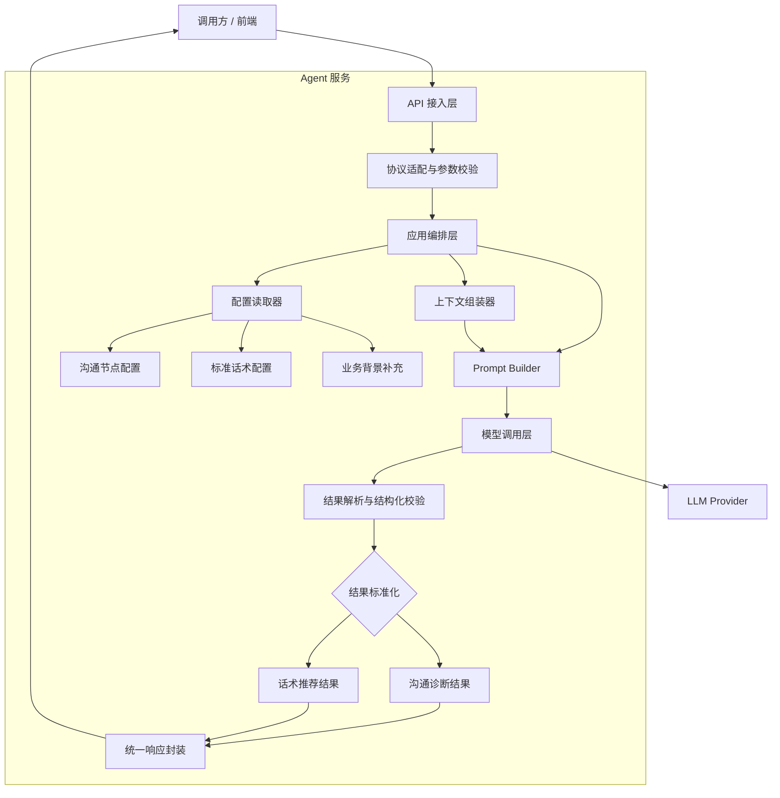

# 话术推荐和沟通诊断实现方案

## 1. API 契约

### 1.1 沟通诊断 API

`POST /api/workflows/conversation-checkpoint`

请求体：

```json
{
  "conversation": {
    "messages": [
      {
        "role": "employee",
        "text": "王总您好，我这边想和您确认一下本周的发货安排。"
      },
      {
        "role": "customer",
        "text": "你先说下是什么事情。"
      }
    ]
  },
  "background": "",
  "supplementary_info": "",
  "covered_checkpoints": [
    {
      "name": "说明来意",
      "description": "客户需要知道这通电话的背景和目的。"
    }
  ],
  "required_checkpoints": [
    {
      "name": "说明来意",
      "description": "客户需要知道这通电话的背景和目的。"
    },
    {
      "name": "获得继续沟通许可",
      "description": "客户明确表达愿意继续听或未表现明显拒绝。"
    }
  ]
}
```

字段说明：

- `conversation.messages`：必填。通话消息列表。
- `conversation.messages[].role`：必填，枚举为 `employee` / `customer`。
- `background`：必填。业务背景信息。
- `supplementary_info`：选填。额外补充信息。
- `covered_checkpoints`：已覆盖的沟通诊断节点，初始化时传 `[]`，后续从 `required_checkpoints` 回填。
- `covered_checkpoints[].name`：必填。本次通话已经覆盖的沟通诊断节点。
- `covered_checkpoints[].description`：选填。帮助大模型理解节点含义。
- `required_checkpoints`：必填。通过配置平台获取，调用前需去重。

成功响应：

```json
{
  "code": 0,
  "message": "success",
  "data": {
    "covered_checkpoints": [
      "说明来意",
      "获得继续沟通许可"
    ]
  }
}
```

### 1.2 话术推荐 API

`POST /api/workflows/script-recommendations`

请求体：

```json
{
  "conversation": {
    "messages": [
      {
        "role": "employee",
        "text": "王总您好，我这边想和您确认一下本周的发货安排。"
      },
      {
        "role": "customer",
        "text": "你先说下是什么事情。"
      }
    ]
  },
  "background": "",
  "supplementary_info": "",
  "covered_checkpoints": [
    {
      "name": "说明来意",
      "description": "客户需要知道这通电话的背景和目的。"
    }
  ],
  "standard_scripts": [
    {
      "type": "双向收费",
      "scripts": [
        {
          "content": "老板，我特别理解您的感受。但您换个角度想，平台就像一座桥，两边收费才能把桥修得更宽更稳。我们收的费用大部分用在了系统维护、司机审核、投诉处理这些保障上。您一年发那么多货，只要有一单因为平台保障避免了损失，这点信息费就值回来了。而且会员用户我们优先推送优质司机，您成交率高，多赚的远不止这点费用了老板"
        },
        {
          "content": "老板我们确实是只有会员费这一个费用，您说的技术服务费我问下公司，您这边是会员我们都是优先推送司机给您接单的，我们现在续费会员有优惠，还给您赠送价值188元的30次发货次数，您看现在方便您就交一下"
        }
      ]
    }
  ]
}
```

字段说明：

- `conversation.messages`：必填。通话消息列表。
- `conversation.messages[].role`：必填，枚举为 `employee` / `customer`。
- `background`：必填。业务背景信息。
- `supplementary_info`：选填。额外补充信息。
- `covered_checkpoints`：已覆盖的沟通节点，初始化时传 `[]`，后续从 `required_checkpoints` 回填。
- `standard_scripts`：必填。通过配置平台获取，调用前需去重。
- `standard_scripts[].type`：标准话术分类。
- `standard_scripts[].scripts[].content`：候选标准话术内容。

成功响应：

```json
{
  "code": 0,
  "message": "success",
  "data": {
    "recommended_scripts": "xxxxx"
  }
}
```

### 1.3 错误响应

两个接口建议统一错误格式：

```json
{
  "code": 0,
  "error": {
    "message": "conversation.messages 不能为空"
  }
}
```

### 1.4 HTTP 状态码

- `200`：请求成功，即使结果为空数组也返回 `200`
- `400`：请求参数错误
- `429`：频率限制
- `500`：服务内部错误
- `504`：上游模型超时

## 2. 背景

目标场景是电话销售 / 外呼辅助。当前已经有两类输入能力：

- ASR 转写结果
- 业务系统提供的通话目标、业务线、客户标签等上下文

这两类能力依赖同一段上下文，但服务目标不同：

- 话术推荐：回答“下一步怎么说”
- 沟通诊断：回答“当前走到哪一步，还缺什么”

本期对外暴露两个无状态 API：

1. 话术推荐
2. 沟通流程诊断

## 3. 设计原则

### 3.1 尽量通用、尽量无状态

服务端不维护会话状态。每次请求都由前端或调用方传入当前要分析的对话窗口和业务配置。

为了保持接口通用，一些策略不写死在 Agent 服务里，而由调用方自行控制后传入，例如：

- 传入多少轮对话窗口
- 调用频率和更新节奏
- 当前阶段或等价状态

Agent 服务只负责消费标准化输入，并返回结构化结果。

### 3.2 输出必须结构化

服务层应约束 LLM 返回 JSON，再由服务端做校验和清洗，避免直接返回不可控自然语言。

## 4. 服务端设计

这一版更关键的不是“谁调用谁”，而是服务端如何分层，才能同时支撑话术推荐和沟通诊断两个接口，并把可变业务配置和通用推理能力拆开。

### 4.1 服务端分层架构



### 4.2 分层职责说明

- API 接入层：负责路由、鉴权、限流、日志、trace id 注入，以及 HTTP 协议层面的错误返回。
- 协议适配与参数校验：把外部请求转成内部统一结构，校验必填字段、枚举值、数组是否为空，避免脏数据直接进入模型调用链路。
- 应用编排层：根据接口类型选择执行路径。话术推荐和沟通诊断在这一层分流，但尽量复用下层能力。
- 配置读取器：从配置平台读取沟通节点、标准话术、背景补充等业务配置，确保可变逻辑不写死在代码里。
- 上下文组装器与 Prompt Builder：把对话窗口、背景信息、已覆盖节点、候选话术等内容拼成受控输入，屏蔽不同接口的 Prompt 差异。
- 模型调用层与结果解析层：统一处理 LLM 调用、超时重试、结构化解析、JSON 校验和兜底清洗，避免上层直接依赖模型原始输出。
- 结果标准化与统一响应封装：把模型输出收敛为稳定契约。沟通诊断只返回 `covered_checkpoints`，话术推荐只返回 `recommended_scripts`，降低前端接入复杂度。

### 4.3 这张图想表达的设计判断

- 两个 API 共享一套通用推理基础设施，而不是各写一条独立链路。
- 服务端负责稳定性和协议一致性，业务策略和业务配置尽量外置。
- 真正需要长期维护的是“配置读取、Prompt 组装、结果校验、结果标准化”这几层，而不是单次模型调用本身。
- 这样设计后，后续无论增加新的沟通诊断节点，还是扩充新的标准话术分类，优先改配置和模板，不需要频繁改接口协议。

## 5. Prompt 组成

Prompt 建议采用模块化拼装，而不是让调用方直接传一整段长文本。

建议至少包含两部分：

系统提示词：
- 系统角色定义
- 输出格式要求

用户提示词：
- 当前任务目标
- 用户目标
- 业务约束
- 当前状态
- 当前对话窗口

## 6. 最佳实践

### 6.1 推荐 API

建议推荐接口显式传入 `current_stage` 或等价字段，而不是完全依赖模型从对话中自行推断当前阶段。

这样做有几个好处：

- 更稳，减少阶段误判
- 可以基于“当前状态 + 目标状态”推荐更合适的话术
- 更符合无状态接口思路，由前端维护状态、服务端消费状态

建议输入候选话术，由 LLM 做理解、排序和轻微改写，而不是完全自由生成。

这样更稳，也更适合业务控制。

### 6.2 诊断 API

`required_checkpoints` 不建议只传字符串数组，最好每个 checkpoint 带 `id`、`name`、`description`，便于模型理解判定标准。

### 6.3 用户提示词要包含目标信息

无论是推荐还是诊断，用户提示词里都应明确给出目标信息，而不只是“分析这段对话”。

至少建议包含：

- 当前业务目标
- 当前用户目标
- 当前任务目标
- 当前状态或目标状态

否则模型只能做泛化判断，推荐结果会偏空泛。

### 6.4 前端负责优化，服务端负责稳定

前端负责：

- 上下文裁剪
- 候选话术召回
- 滑动窗口
- 当前状态维护
- 不同业务线策略切换
- 截流和更新频率限制

服务端负责：

- Prompt 拼装
- LLM 调用
- JSON 校验
- 结构化结果返回

### 6.5 后续优化方向

这一版先做通用协议，后续可以逐步增强：

- few-shot 模板：为不同业务线沉淀更稳定的输入输出示例
- 优秀话术模板：把历史转化效果好的话术作为高质量候选或示例注入
- 分阶段模板：不同状态下切换不同的 Prompt 模板和推荐策略
